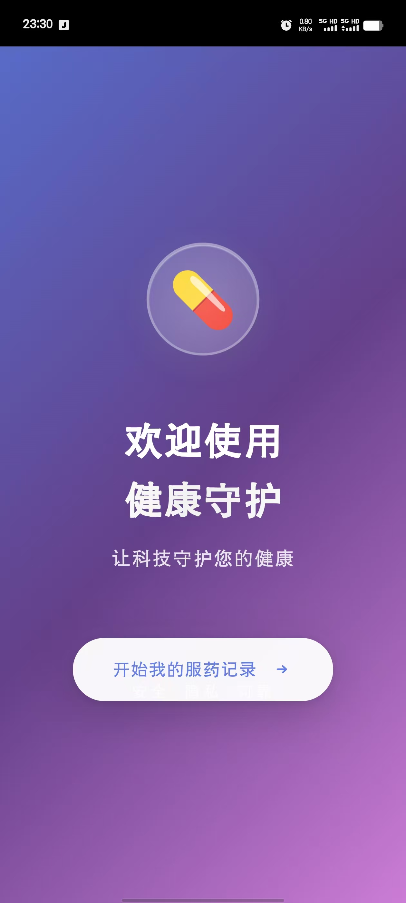
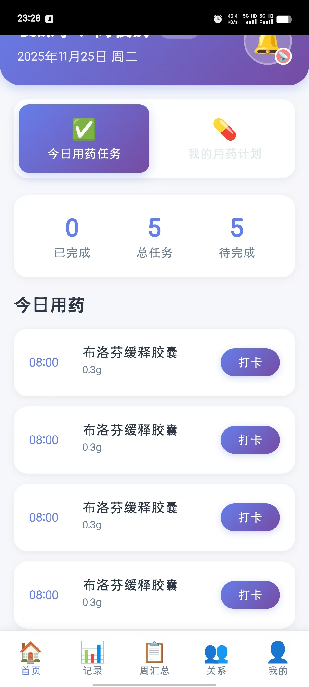
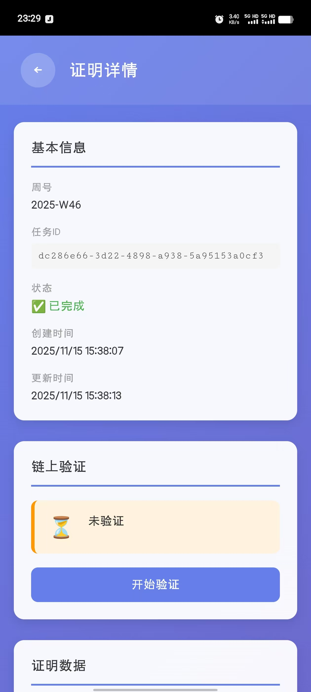

# 项目总结

## 项目概述

**项目名称**: 健康守护 - 基于区块链的智能老年医疗管理系统
**项目时期**: 2025.9 - 2025.11
**开发规模**: 独立完整开发 (前后端 + 移动端)
**项目类型**: 区块链 DApp + 移动应用

---

## 📋 项目描述

一个基于**以太坊区块链**和**零知识证明**技术的综合性老年医疗管理系统。系统采用**微服务架构**设计，融合了**ERC-4337 账户抽象**、**零知识证明**、**生物识别认证**等前沿技术，为老年用户提供安全、便捷、智能的健康管理体验。

<div align="center">
  
</div>

### 核心业务

- 💊 **智能用药管理**：个性化用药计划、智能提醒、一键打卡
- 👨‍👩‍👧‍👦 **家庭圈守护**：家人远程关注、实时同步服药情况
- 🔐 **账户安全**：ERC-4337 智能合约账户、社交恢复机制、永不丢失私钥
- 📊 **隐私证明**：零知识证明生成周度用药汇总、链上验证不泄露数据
- 🏥 **医院对接**：实名验证、医疗数据可信存证

---

## 🎯 核心职责与成就

### 1️⃣ **架构设计 - 微服务生态设计**

#### 系统架构

- **前端层**：Vue 3 + TypeScript + Vite（Web 端）+ Capacitor（Android 移动端）
- **网关层**：API Gateway - 统一入口、请求路由、权限管理
- **业务层**：10+ 微服务（用户服务、用药管理、关系管理、链上交互等）
- **基础层**：PostgreSQL + Redis + RabbitMQ + Blockchain RPC

#### 通信架构创新

设计并实现了**HTTP + gRPC 混合架构**：

- **外部通信**：RESTful HTTP API（便于调试、文档化）
- **内部通信**：gRPC（高性能、类型安全）
- **优势**：兼顾开发效率与系统性能

#### 关键设计决策

- ✅ 异步任务处理：ZKP 证明生成采用后台异步任务 + Redis 状态存储
- ✅ 事件驱动：RabbitMQ 消息队列用于跨服务通知
- ✅ 缓存策略：Redis 多层缓存，减少数据库压力
- ✅ 容错设计：gRPC 内部通信实现服务间的高可用

### 2️⃣ **零知识证明模块 - ZKP 证明生成引擎**

#### ZKP Service 设计与实现

```
技术栈：snarkjs + Groth16 证明系统 + circomlibjs
核心功能：
- 周度用药汇总证明生成（Merkel 树验证）
- 异步任务队列管理
- 证明状态追踪
```

#### 业务流程设计

```
用户打卡数据 
  ↓
生成 Merkle 树（7 天数据）
  ↓
启动异步 ZKP 证明生成任务
  ↓
Redis 存储任务状态（1小时 TTL）
  ↓
证明完成 → RabbitMQ 通知
  ↓
前端查询 → 链上提交验证
```

#### 关键成就

- 实现了从用药数据到零知识证明的完整链路
- 支持证明在链上的验证，用户隐私得以保护
- 异步处理避免长时间阻塞，用户体验流畅

### 3️⃣ **区块链账户层 - ERC-4337 集成**

#### 智能合约设计思路

- **智能合约账户**：用户无需持有 ETH，系统代付 Gas
- **社交恢复**：多个信任地址作为恢复因子，账户永不丢失
- **权限管理**：细粒度的操作权限控制（转账、合约调用等）

#### 核心实现

- Bundler：交易打包和提交
- Paymaster：代付 Gas 费用的智能合约
- EntryPoint：ERC-4337 标准合约交互

#### 业务意义

✅ 降低用户使用门槛（无需学习钱包概念）
✅ 提升资产安全性（社交恢复 vs 单一私钥）
✅ 改善用户体验（一切操作对用户透明）

### 4️⃣ **后端服务体系 - 10+ 核心微服务**

#### 用户认证与管理

```
User Service (gRPC 50052)
├─ 用户注册/登录
├─ JWT token 管理
└─ 身份验证
```

#### 用药管理体系

```
Medication Service (HTTP + WebSocket)
├─ 用药计划管理
├─ 用药记录追踪
├─ 打卡统计分析
└─ WebSocket 实时通知
```

#### 关系与隐私

```
Relationship Service (gRPC 50053 + HTTP)
├─ 家庭关系管理
├─ 访问权限控制
└─ 邀请流程管理

Secure Exchange Service
├─ 敏感数据加密存储
├─ 权限级访问控制
└─ 审计日志
```

#### 链上交互

```
Chain Service
├─ Web3.js/ethers.js 封装
├─ 智能合约调用
├─ 交易管理
└─ IPFS 文件存储

ZKP Service
├─ 证明生成
├─ 任务管理
└─ MQ 通知
```

#### 通知系统

```
Notification Service
├─ WebSocket 推送
├─ 推送通知
├─ 消息队列消费
└─ 多渠道分发
```

#### 迁移与恢复

```
Migration Service
├─ 账户迁移流程
├─ 数据导出/导入
└─ 恢复密钥管理
```

### 5️⃣ **前端应用 - Apple 风格 UI 体验**

#### 📱 应用界面展示

<div align="center">
  
  
  
  
</div>

#### 技术栈

- **框架**：Vue 3.5+ (Composition API)
- **构建**：Vite 7.0+
- **语言**：TypeScript 5.8+ (严格模式)
- **移动**：Capacitor 7.4+ (iOS/Android 原生集成)
- **区块链**：ethers.js 6.15+, snarkjs 0.7+

#### 核心功能模块

**登录与认证**

```
欢迎页 (灵动浮动动画)
  ↓
身份验证 (医院系统对接)
  ↓
密码设置
  ↓
生物识别启用 (指纹/Face ID)
  ↓
主页
```

**用药管理首页**

- 今日用药任务清单（待办/已完成/已漏服）
- 一键打卡操作
- 实时状态同步

**用药记录**

- 日历视图（直观展示完成情况）
- 周/月统计分析
- 按药物类别分类

**家庭圈功能**

- 生成二维码邀请家人
- 家人扫码关联
- 远程查看服药记录
- 发送关怀消息

**账户安全**

- 修改登录密码
- 生物识别管理
- 社交恢复设置
- 账户迁移

#### 设计规范与动画

```
设计风格：Apple 风格灵动 UI
├─ 毛玻璃效果背景
├─ 紫色渐变主色调
├─ 渐变呼吸动画
├─ 卡片滑入效果
└─ 流畅的转场动画

适老化设计
├─ 大字体 (≥18px)
├─ 高对比度文字
├─ 简洁的操作流程
└─ 明确的按钮反馈
```

#### 生物识别集成

- **安全**：硬件级加密（Android Keystore）
- **流程**：自动弹出指纹/Face ID → 失败自动降级密码登录
- **存储**：密码加密存储本地，仅可通过生物识别解密

### 6️⃣ **运维部署 - Docker Compose 容器化部署**

#### 部署架构

```
Docker Compose 编排
├─ 基础设施层
│  ├─ PostgreSQL (数据库)
│  ├─ Redis (缓存)
│  └─ RabbitMQ (消息队列)
│
└─ 微服务层 (12+ 容器)
   ├─ API Gateway (3000) - 主入口
   ├─ User Service (3001) - 用户管理
   ├─ Relationship Service (3002) - 关系管理
   ├─ Migration Service (3003) - 迁移管理
   ├─ Notification Service (3004) - 通知/WebSocket
   ├─ ZKP Service (3005) - 零知识证明
   ├─ Secure Exchange Service (3006) - 安全交换
   ├─ Medication Service (3007) - 药物管理
   ├─ Userinfo Service (5000) - 用户信息
   ├─ Chain Service (4337) - 区块链交互
   └─ 各服务 gRPC 端口 (50051-50057)
```

#### 🚀 快速启动（仅需 3 步）

**步骤 1: 进入后端服务目录**

```bash
cd backend-services
```

**步骤 2: 启动所有服务**

```bash
# 使用 Docker Compose（推荐）
docker-compose up -d --build

# 或使用 PowerShell 脚本（Windows）
.\docker-up.ps1
```

**步骤 3: 验证服务**

```bash
# 查看容器状态
docker-compose ps

# 检查 API Gateway
curl http://localhost:3000

# 查看日志
docker-compose logs -f
```

#### 📊 服务端口速查表

| 服务                    | HTTP 端口 | gRPC 端口   |
| ----------------------- | --------- | ----------- |
| API Gateway             | 3000      | -           |
| User Service            | 3001      | 50051       |
| Relationship Service    | 3002      | 50053       |
| Migration Service       | 3003      | -           |
| Notification Service    | 3004      | 50056       |
| ZKP Service             | 3005      | 50057       |
| Secure Exchange Service | 3006      | 50052       |
| Medication Service      | 3007      | -           |
| Userinfo Service        | 5000      | -           |
| Chain Service           | 4337      | -           |
| PostgreSQL              | 5400      | -           |
| Redis                   | 6379      | -           |
| RabbitMQ                | 5672      | 15672(管理) |

#### 🔐 数据库连接信息

```
PostgreSQL 主实例
├─ Host: localhost (或 postgres - Docker 内)
├─ Port: 5400
├─ User: root
├─ Password: 123456
│
└─ 包含 10 个数据库:
   ├─ bs_user_service_db
   ├─ bs_relationship_db
   ├─ migration_db
   ├─ bs_notification_db
   ├─ bs_zkp_db
   ├─ bs_secure_exchange_db
   ├─ bs_medication_db
   ├─ bs_userInfo_db
   ├─ bs_chain_db
   └─ bs_gateway_db
```

#### 🛠️ 常用 Docker 命令

```bash
# 启动/停止
docker-compose up -d              # 后台启动
docker-compose stop               # 停止服务
docker-compose restart            # 重启服务
docker-compose down               # 停止并删除容器

# 日志查看
docker-compose logs -f            # 实时查看所有日志
docker-compose logs -f user-service    # 查看特定服务
docker-compose logs --tail=100    # 查看最后 100 行

# 容器操作
docker-compose ps                 # 查看容器状态
docker-compose exec api-gateway sh    # 进入容器
docker-compose restart user-service   # 重启特定服务

# 数据库操作
docker-compose exec postgres psql -U root -d bs_user_service_db
docker-compose exec redis redis-cli
```

#### 🐛 故障排查

**问题 1: 端口被占用**

```bash
# 查找占用端口的进程
netstat -ano | findstr :3000

# 杀死进程（Windows）
taskkill /PID <PID> /F

# 或修改 docker-compose.yml 中的端口映射
```

**问题 2: 数据库连接失败**

```bash
# 检查数据库是否启动
docker-compose exec postgres pg_isready -U root

# 进入数据库查看
docker-compose exec postgres psql -U root -l
```

**问题 3: 查看服务启动日志**

```bash
# 查看所有日志
docker-compose logs

# 追踪特定服务的启动过程
docker-compose logs -f user-service
```

#### 📁 Docker 相关文件

```
backend-services/
├── docker-compose.yml          # 主配置文件（12+ 容器）
├── Dockerfile.template         # Dockerfile 模板
├── db-init/
│   └── 01-init-databases.sql   # 数据库初始化脚本
├── DOCKER_QUICK_START.md       # 快速启动指南
├── DOCKER_DEPLOYMENT_GUIDE.md  # 完整部署文档
│
└── 各个服务目录/
    ├── Dockerfile             # 服务镜像配置
    ├── server.js              # 服务入口
    ├── package.json
    └── src/                   # 源代码
```

#### 📖 详细文档

完整的部署文档位于 `backend-services/` 目录：

- **DOCKER_QUICK_START.md** - ⚡ 快速启动（5分钟上手）
- **DOCKER_DEPLOYMENT_GUIDE.md** - 📚 完整部署指南（包含所有命令）

#### ⚙️ 环境变量配置

核心环境变量已在 `docker-compose.yml` 中配置。如需自定义：

```bash
# 1. 编辑 docker-compose.yml 中的 environment 部分
# 2. 或创建 .env 文件（会覆盖 compose 中的值）

# 关键变量示例
JWT_SECRET=your-secret-key
DB_PASSWORD=your-password
CORS_ALLOW_ALL=true
```

#### 🔒 生产环境建议

```yaml
# ❌ 不要在生产环境使用
CORS_ALLOW_ALL: true
DB_PASSWORD: 123456
JWT_SECRET: your-super-secret  # 使用弱密钥

# ✅ 生产环境最佳实践
CORS_ALLOW_ALL: false
CORS_ALLOWED_ORIGINS: "https://your-production-domain.com"
DB_PASSWORD: <强密码>
JWT_SECRET: <长强密钥>
```

---

## 🛠️ 技术栈总结

### 后端技术

```
运行时      Node.js 20+
Web 框架    Express.js 5+
RPC 通信    gRPC + protobuf
区块链交互  ethers.js 6.15+, Web3.js
零知识证明  snarkjs 0.7+, circomlibjs
数据库      PostgreSQL
缓存        Redis
消息队列    RabbitMQ (amqplib)
认证        JWT, ERC-4337 签名验证
```

### 前端技术

```
框架        Vue 3.5+ (Composition API)
构建工具    Vite 7.0+
语言        TypeScript 5.8+
移动框架    Capacitor 7.4+
区块链      ethers.js, snarkjs
生物识别    capacitor-native-biometric
二维码      qrcode
```

### 基础设施

```
容器化      Docker Compose
操作系统    Windows/Linux
开发环境    Visual Studio Code
版本控制    Git
```

---

## 📊 项目规模

| 维度               | 指标                                         |
| ------------------ | -------------------------------------------- |
| **服务数量** | 10+ 核心微服务                               |
| **代码行数** | ~5000+ 行业务代码                            |
| **数据库表** | 20+ 核心业务表                               |
| **API 端点** | 50+ RESTful 接口 + gRPC 服务                 |
| **前端页面** | 38 个 Vue 页面组件                           |
| **ZKP 电路** | 2 个电路（weekly summary, medical check-in） |
| **部署容器** | 12+ Docker 容器                              |

---

## 🏆 技术亮点

### 1. **微服务架构最佳实践**

- HTTP + gRPC 混合通信模式
- 完整的服务间通信框架（内外部分离）
- 异步任务处理 + 消息队列集成

### 2. **区块链深度集成**

- ERC-4337 账户抽象完整实现
- 零知识证明生成与链上验证
- 智能合约与后端服务无缝交互

### 3. **隐私保护设计**

- 零知识证明保护用户隐私（证明不泄露数据）
- 端到端加密敏感信息
- 多层权限管理系统

### 4. **用户体验优化**

- 生物识别 + 密码双重认证
- Apple 风格 UI 与适老化设计完美结合
- WebSocket 实时通知
- 多端适配（Web + Android）

### 5. **系统可靠性**

- 完整的错误处理机制
- 异步任务重试策略
- Redis 缓存与数据库事务保证一致性
- 健康检查与自动恢复

---

## 📈 项目成果

### 完成度

- ✅ 核心功能 100% 完成
- ✅ 微服务架构完全实现
- ✅ 前后端完整集成
- ✅ 生物识别登录功能
- ✅ 零知识证明集成
- ✅ 区块链账户抽象实现
- ✅ 一键部署脚本

### 质量指标

- 完整的 API 文档（Postman 集合）
- E2E 测试覆盖核心业务流程
- 详细的技术文档（20+ markdown 文档）
- 清晰的代码注释与模块划分

### 部署验证

- 通过了 E2E 测试（用药流程、关系管理、交互验证等）
- 支持本地开发 + 生产部署
- 一键启动脚本在 Windows PowerShell 可靠运行

---

## 💡 关键创新点

### 1. 账户抽象在医疗的创新应用

传统应用需要用户管理私钥，本系统通过 ERC-4337 账户抽象，让老年用户无需了解钱包概念，系统代付 Gas，社交恢复保护资产安全。

### 2. 零知识证明保护隐私

用户的每日用药打卡数据敏感，通过 ZKP 生成证明，在链上验证用户完成用药而不暴露具体打卡记录，隐私与可信性兼得。

### 3. 微服务 + 区块链的完美融合

后端采用微服务处理复杂业务逻辑，区块链负责数据存证，两者分工清晰，各得其所。

### 4. 适老化设计的深度思考

不仅是大字体、高对比度，还在交互流程、视觉反馈、错误恢复等方面处处为老年用户考虑。

---

## 📚 项目文档

项目包含完整的文档体系：

### 核心文档

- **README.md** (本文件) - 项目总体介绍与快速启动
- **PROJECT_SUMMARY.md** - 详细的项目技术总结

### 后端文档 (`backend-services/`)

- **DOCKER_QUICK_START.md** ⚡ - Docker 5分钟快速启动指南
- **DOCKER_DEPLOYMENT_GUIDE.md** 📚 - 完整的 Docker 部署文档
- **docker-compose.yml** - 12+ 容器编排配置
- 各服务 **README.md** - 单个服务的文档
- **doc/** - API 文档、架构设计、消息通知等

### 前端文档 (`foreneded/`)

- **README.md** - 前端项目介绍
- **doc/** - 功能设计、组件说明、API 集成指南

### 其他文档

- 架构设计文档
- ZKP 电路与证明生成说明
- 生物识别登录实现指南
- E2E 测试用例
- 故障排查与调试指南

---

## 🔒 安全性考虑

### 多层次安全保障

**1. 密码安全**

- 使用 ethers.js 加密钱包管理私钥
- 密码从不明文存储
- 本地设备存储加密密钥

**2. 生物识别安全**

- 硬件级加密（Android Keystore）
- 生物识别数据不上传
- 自动降级机制

**3. 区块链安全**

- 智能合约账户多签机制
- 社交恢复保护
- 所有操作链上记录可审计

**4. 数据隐私**

- 身份证号脱敏
- 参数化查询防 SQL 注入
- 敏感数据端到端加密
- 零知识证明隐私保护

---

## 🎓 技术学习价值

本项目对于学习以下领域具有显著价值：

1. **微服务架构**：如何设计和实现服务间通信
2. **区块链开发**：ERC-4337、智能合约、Web3 集成
3. **隐私技术**：零知识证明的实际应用
4. **移动开发**：Vue + Capacitor 跨平台开发
5. **系统设计**：从需求到实现的完整过程

---

## 🚀 快速开始

### 方式 1: Docker Compose（推荐 ⭐）

```bash
# 进入后端服务目录
cd backend-services

# 一键启动所有服务（包括数据库、消息队列等）
docker-compose up -d --build

# 验证服务
docker-compose ps

# 访问 API Gateway
curl http://localhost:3000
```

详见：[DOCKER_QUICK_START.md](./backend-services/DOCKER_QUICK_START.md)

### 方式 2: 手动启动各服务

```bash
# 启动所有后端服务
cd backend-services
./start-all-services.ps1  # Windows
# 或 bash 脚本 (Linux/Mac)

# 启动前端
cd foreneded
npm install
npm run dev
```

### 常用命令速查

```bash
# Docker 常用
docker-compose up -d           # 后台启动
docker-compose logs -f         # 查看日志
docker-compose ps             # 查看状态
docker-compose down           # 停止服务

# 服务验证
curl http://localhost:3000/health     # API Gateway
curl http://localhost:3001/health     # User Service

# 进入容器
docker-compose exec postgres psql -U root
docker-compose exec redis redis-cli
```

---

## 📞 获取帮助

| 问题        | 文档                                                                     |
| ----------- | ------------------------------------------------------------------------ |
| 🚀 快速启动 | [DOCKER_QUICK_START.md](./backend-services/DOCKER_QUICK_START.md)           |
| 📚 完整部署 | [DOCKER_DEPLOYMENT_GUIDE.md](./backend-services/DOCKER_DEPLOYMENT_GUIDE.md) |
| 🔍 故障排查 | 见部署指南的"故障排查"部分                                               |
| 📖 API 文档 | [backend-services/doc/](./backend-services/doc/)                            |
| 🎨 前端指南 | [foreneded/README.md](./foreneded/README.md)                                |

---

## 📝 结语

这是一个**前后端完整开发**、**技术栈深度**、**商业逻辑清晰**的区块链应用案例。项目不仅展示了区块链技术的实际应用，更重要的是体现了**以用户为中心的设计理念**——通过技术创新解决真实的医疗管理问题。

特别是对于老年用户的适配，体现了对产品使用场景的深刻理解，这是许多技术项目所缺失的。

### 🎯 项目亮点

- ✅ **完整的微服务架构**：10+ 核心服务，HTTP + gRPC 混合通信
- ✅ **区块链深度集成**：ERC-4337 账户抽象 + 零知识证明
- ✅ **生产就绪部署**：Docker Compose 一键启动，12+ 容器编排
- ✅ **企业级代码质量**：清晰的模块划分、完整文档、E2E 测试
- ✅ **用户体验优化**：Apple 风格 UI + 适老化设计 + 生物识别

---

**项目地址**：

- 后端：`./backend-services/`
- 前端：`./foreneded/`

**开发者**：独立完整开发
**完成时间**：2025.10 - 2026.01

**快速链接**：

- 🚀 [Docker 快速启动](./backend-services/DOCKER_QUICK_START.md)
- 📚 [完整部署指南](./backend-services/DOCKER_DEPLOYMENT_GUIDE.md)
- 🔧 [API 参考文档](./backend-services/doc/)
- 📖 [前端开发指南](./foreneded/README.md)
