### **最终项目报告：基于ERC4337与零知识证明的隐私保护用药依从性平台**

**版本：V2.1 - 用药管理系统已完成**
**日期：2025年10月31日**

---

#### **第一部分：项目概述与愿景**

##### **1.1 项目摘要 (Executive Summary)**

本项目旨在解决全球老龄化背景下，老年人用药依从性追踪的核心难题——**信任缺失与隐私泄露**。我们设计并正在实现一个创新的智能健康平台，通过深度整合**ERC4337账户抽象、社交恢复、去中心化身份 (DID)、零知识证明 (ZKP) 和细粒度权限管理**，构建了一个在保障用户绝对隐私和数据主权前提下的、数学上可信的健康记录系统。

##### **1.2 实施状态说明**

**✅ 已实现的核心功能 (Phase 1 & 2)**:

**Phase 1 - 基础设施** (2025年10月中旬完成):
- **ERC4337账户抽象**: 基于智能合约的账户系统，支持Gas代付
- **社交恢复机制**: 通过守护者实现账户恢复，无需助记词
- **用户身份认证**: 基于EOA签名的去中心化身份验证
- **访问组权限管理**: 细粒度的权限控制系统
- **关系管理系统**: 邀请机制、关系暂停/恢复/撤销
- **账户迁移服务**: 支持设备间的安全账户迁移
- **个人档案服务**: 身份信息验证与管理
- **消息通知服务**: 多渠道通知推送（WebSocket/FCM/APNs）
- **安全数据传输服务**: 端到端加密数据传输
- **ZKP证明生成服务**: 异步零知识证明生成（后端重量级计算）

**Phase 2 - 应用层** (2025年10月30日完成):
- **用药管理系统**: ✅ 已完成
  - 常用药物库（150种药物，9大分类）
  - 用药计划管理（CRUD）
  - 计划加密分享（基于访问组）
  - 与Secure Exchange Service集成（端到端加密）
  - 完整的E2E测试（1028行测试代码）

**🚧 Phase 2进行中功能**:
- **零知识证明打卡**: 规划中（前端轻量级）
- **用药提醒推送**: 开发中
- **用药记录统计**: 规划中
- **周度汇总上链**: 规划中（将ZKP证明提交区块链）
- **AI隐私分析**: 规划中（基于脱敏数据的智能健康分析）

##### **1.3 项目愿景与目标**

*   **愿景**: 创建一个用户可以绝对掌控自己健康数据，并能向其信任的人（家人、医生）无缝、可信地证明其健康行为的去中心化网络。
*   **核心目标**:
    1.  **信任**: 提供一份不可篡改、数学上可验证的用药记录。
    2.  **隐私**: 确保除用户明确授权方外，任何人都无法访问用户的健康详情。
    3.  **易用**: 为老年用户提供"零摩擦"的体验，完全屏蔽所有Web3技术的复杂性。
    4.  **安全**: 通过社交恢复机制，无需助记词即可恢复账户。

---

#### **第二部分：软件架构设计**

##### **2.1 核心架构原则**

*   **用户主权**: 私钥永不离开用户设备，用户完全掌控自己的数字身份。
*   **信任最小化**: 后端服务器不存储敏感数据，仅作为协调者和中继者。
*   **零Gas费用**: 所有链上操作由Paymaster代付，用户无需持有ETH。
*   **社交恢复**: 通过守护者机制，即使丢失私钥也能恢复账户。

##### **2.2 系统组件详解**

*   **客户端 (Vue + Capacitor)**: 负责UI、身份管理（EOA钱包）、权限管理、本地数据加密、ZKP证明生成。
*   **API Gateway (Node.js)**: 统一入口，负责认证、路由转发、请求日志。
*   **微服务集群**:
    - **User Service**: 用户注册、登录、角色管理 (HTTP 3001, gRPC 50051)
    - **Relationship Service**: 访问组、邀请、关系管理 (HTTP 3004, gRPC 50052)
    - **ERC4337 Service**: 账户抽象、社交恢复、守护者管理 (HTTP 3002, gRPC 50053)
    - **Userinfo Service**: 个人档案查询、身份验证 (HTTP 5000)
    - **Secure Exchange Service**: 加密数据传输、端到端加密 (HTTP 3006, gRPC 50056)
    - **Medication Service**: 用药计划、药物信息库、计划分享 (HTTP 3007, gRPC 50057) ✅ 新增
    - **Migration Service**: 设备迁移、会话管理 (HTTP 3008)
    - **Notification Service**: 实时通知、WebSocket推送、消息队列 (HTTP 3005, WebSocket)
    - **ZKP Service**: 零知识证明生成、任务管理 (HTTP 3003)
*   **区块链层 (Solidity)**: 
    - **EntryPoint**: ERC4337标准入口点
    - **SocialRecoveryAccount**: 社交恢复账户合约
    - **SimplePaymaster**: Gas代付合约
    - **ZKP验证合约** (规划中): 用于验证用药打卡证明

##### **2.3 架构图**

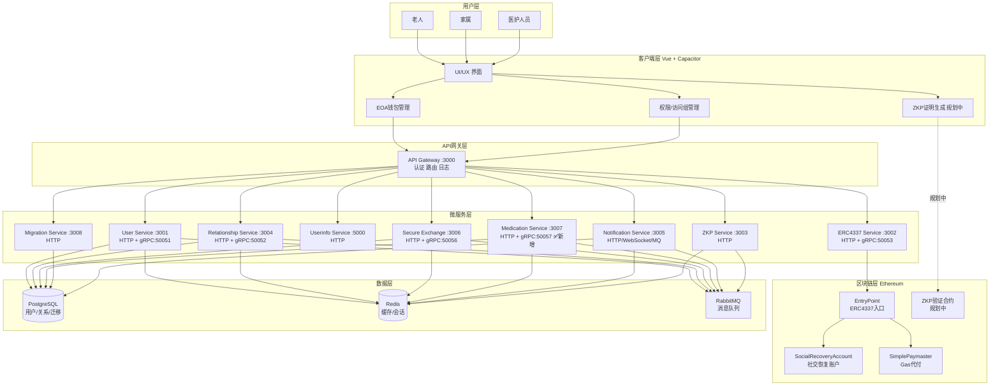

##### **2.4 数据库架构**

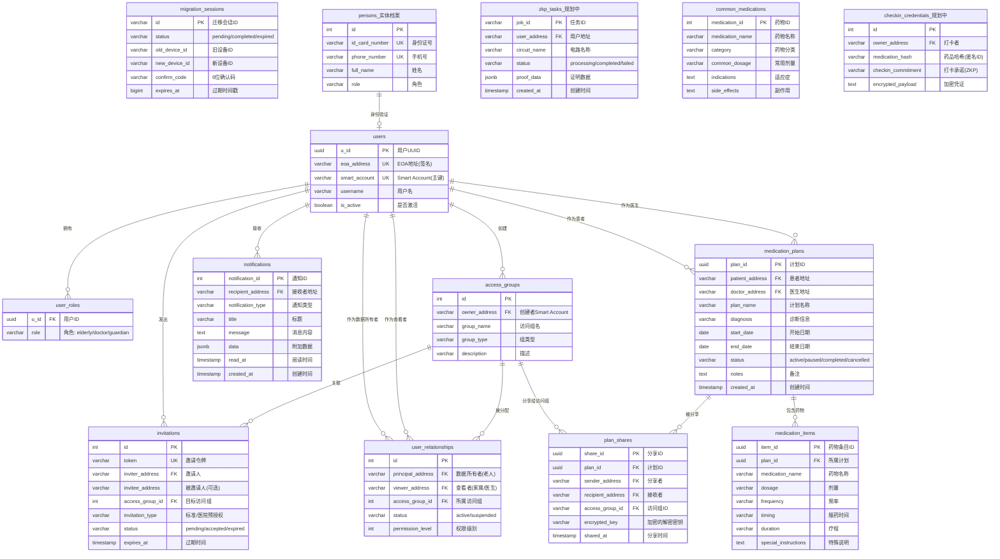

---

#### **第三部分：核心功能与用户界面**

##### **3.1 首次启动与账户创建 ✅已实现**

**流程**: 用户首次打开App，系统引导创建EOA钱包和ERC4337社交恢复账户。

**线框图**:
```
+-------------------------------------------+
|                                           |
|         欢迎使用 ZKP健康守护               |
|                                           |
|    [插图：一个盾牌和爱心]                  |
|                                           |
|   我们将为您创建一个安全的数字身份          |
|   无需记住复杂的助记词                     |
|                                           |
|   [ 请输入一个密码保护您的钱包 ]           |
|   ( ******* )                             |
|                                           |
|   [ 请再次确认密码 ] ( ******* )          |
|                                           |
|           +-----------------+             |
|           |   创建我的数字身份  |             |
|           +-----------------+             |
|                                           |
|  提示：您的私钥将安全存储在本地设备中        |
|       系统将自动创建智能账户               |
|                                           |
+-------------------------------------------+
```

**技术细节**:
1. 客户端生成EOA密钥对（私钥本地加密存储）
2. 调用API预计算Smart Account地址
3. 完成注册，系统自动为老人创建默认访问组

##### **3.2 主界面与每日打卡 🚧规划中**

**流程**: 用户进入主界面，看到今日的用药任务，点击打卡。

**线框图**:
```
+-------------------------------------------+
|  张大爷, 早上好！  [头像]                  |
|  今天是 2025年10月28日 星期一             |
|  Smart Account: 0x1234...5678            |
|-------------------------------------------|
|                                           |
|   **今日用药任务 (2)**                     |
|                                           |
|  +---------------------------------------+  |
|  | [上午8:00] 氨氯地平 (降压药)          |  |
|  |                                [ 打卡 ] |  |
|  +---------------------------------------+  |
|                                           |
|  +---------------------------------------+  |
|  | [晚上8:00] 维生素D3                   |  |
|  |                                (待办)   |  |
|  +---------------------------------------+  |
|                                           |
|   [查看本周记录]   [管理我的家庭圈]         |
|                                           |
|-------------------------------------------|
| [首页]  [记录]  [守护者]  [我的]           |
+-------------------------------------------+
```

##### **3.3 守护者管理 (社交恢复) ✅已实现**

**流程**: 用户设置守护者（家人/朋友），当丢失私钥时可通过守护者恢复账户。

**线框图**:
```
+-------------------------------------------+
| < 返回          我的守护者                 |
|-------------------------------------------|
|                                           |
| **当前守护者 (2/3)**                       |
| 恢复阈值: 至少2人同意即可恢复账户           |
|                                           |
| +---------------------------------------+ |
| | 👤 张小明 (儿子)                       | |
| |    Smart Account: 0xabc...def         | |
| |    状态: ✅ 已确认                     | |
| +---------------------------------------+ |
|                                           |
| +---------------------------------------+ |
| | 👤 李美丽 (女儿)                       | |
| |    Smart Account: 0x123...789         | |
| |    状态: ✅ 已确认                     | |
| +---------------------------------------+ |
|                                           |
| [➕ 添加守护者]   [⚙️ 修改阈值]            |
|                                           |
| 💡 提示：守护者可以帮助您在丢失密码时       |
|   恢复账户，建议设置2-3位可信赖的家人       |
|                                           |
+-------------------------------------------+
```

##### **3.4 权限管理 (访问组) ✅已实现**

**流程**: 老人创建访问组，邀请不同的人加入，实现细粒度权限控制。

**线框图**:
```
+-------------------------------------------+
| < 返回          我的家庭圈                 |
|-------------------------------------------|
|                                           |
| **访问组 (3)**                            |
|                                           |
| +---------------------------------------+ |
| | 📋 主治医生                            | |
| |    成员: 1人                           | |
| |    [管理] [邀请]                       | |
| +---------------------------------------+ |
|                                           |
| +---------------------------------------+ |
| | 📋 家庭核心成员                        | |
| |    成员: 2人                           | |
| |    [管理] [邀请]                       | |
| +---------------------------------------+ |
|                                           |
| +---------------------------------------+ |
| | 📋 子女                                | |
| |    成员: 3人                           | |
| |    [管理] [邀请]                       | |
| +---------------------------------------+ |
|                                           |
| [➕ 新建访问组]                           |
|                                           |
| 💡 访问组可以控制谁能看到您的健康数据       |
|                                           |
+-------------------------------------------+
```

##### **3.5 邀请流程 ✅已实现**

**线框图**:
```
+-------------------------------------------+
| < 返回          邀请新成员                 |
|-------------------------------------------|
|                                           |
| **选择访问组**                            |
| [v] 主治医生                              |
|                                           |
| **邀请方式**                              |
|                                           |
| ( ) 标准邀请 - 生成二维码/链接             |
| (•) 医院邀请 - 输入医生Smart Account       |
|                                           |
| Smart Account地址:                        |
| [ 0x... ]                                |
|                                           |
| 医院信息:                                 |
| 医院ID: [ hospital_001 ]                  |
| 医院名称: [ XX社区卫生服务中心 ]           |
|                                           |
| [生成邀请]                                |
|                                           |
| --- 生成后 ---                            |
| [二维码显示区域]                          |
|                                           |
| 邀请令牌: inv_abc123def456                |
| 有效期: 24小时                            |
|                                           |
| [分享] [取消邀请]                         |
|                                           |
+-------------------------------------------+
```

---

#### **第四部分：核心技术流程详解**

#### **阶段一：已实现的流程**

##### **图 1：身份创建与ERC4337账户部署 ✅**

**流程描述**: 新用户首次打开App，系统创建EOA钱包和ERC4337社交恢复账户。

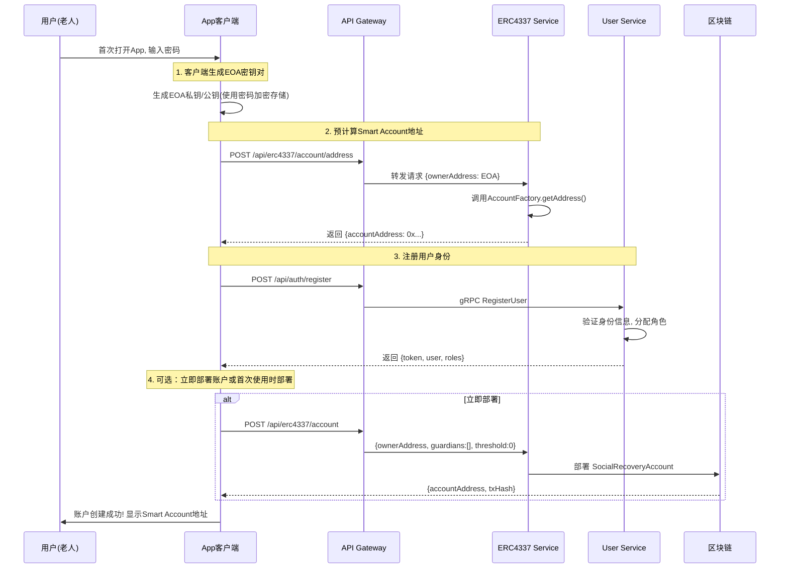

---

##### **图 2：添加守护者 (社交恢复设置) ✅**

**流程描述**: 用户添加守护者，采用安全的两步式流程（私钥永不上传）。

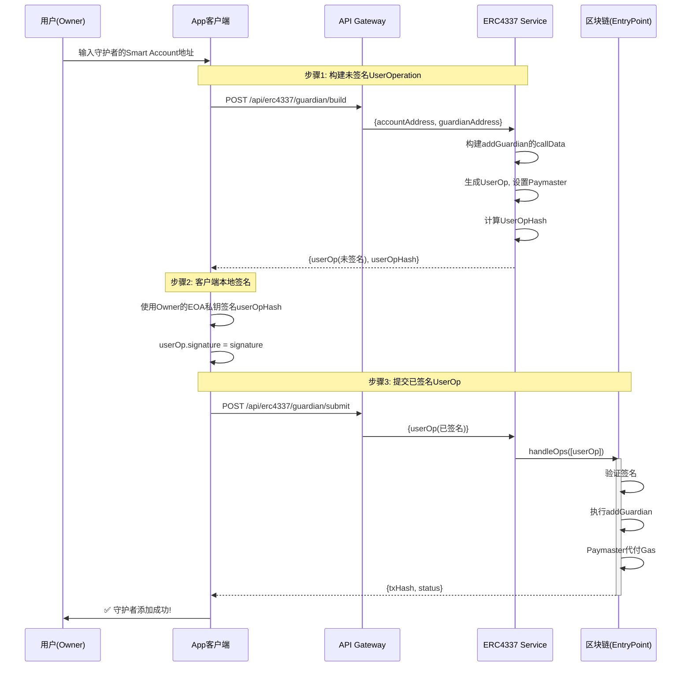

---

##### **图 3：建立关系与分配访问组 ✅**

**流程描述**: 老人创建访问组，通过邀请机制关联联系人。

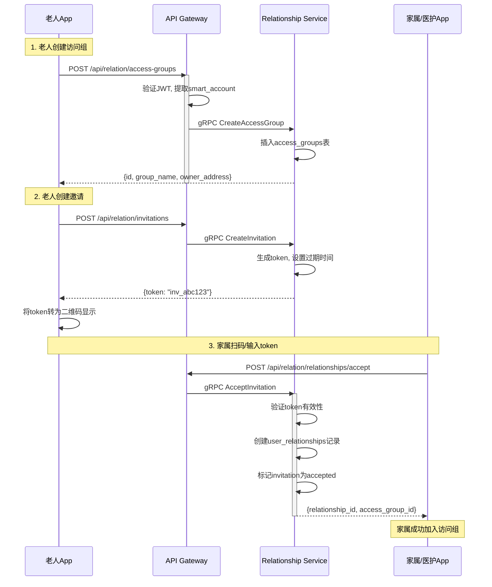

---

##### **图 4：账户社交恢复流程 ✅**

**流程描述**: 用户丢失私钥后，通过守护者投票恢复账户。

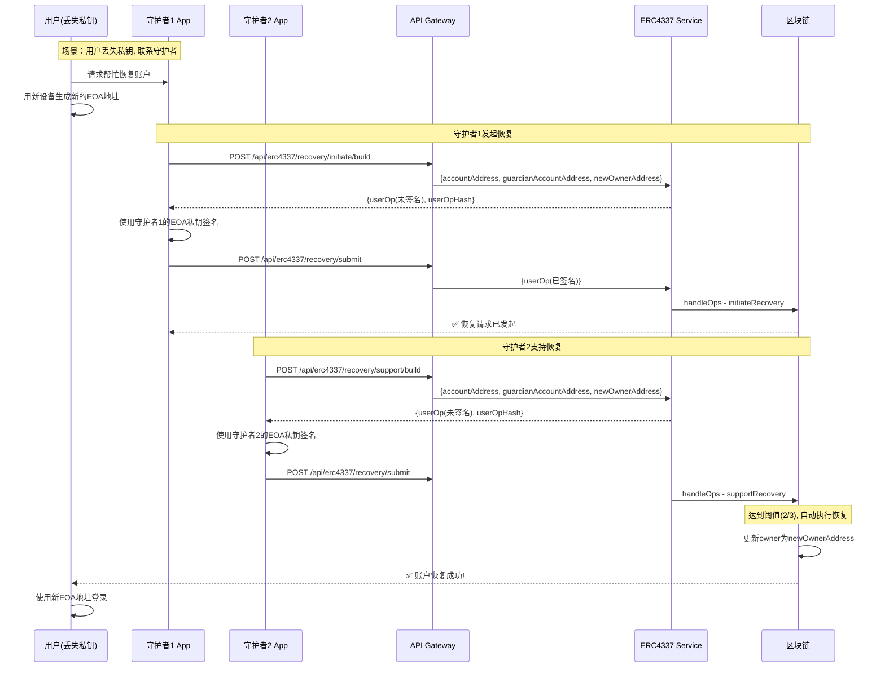

---

##### **图 5：用户登录认证 ✅**

**流程描述**: 基于EOA签名的去中心化登录流程。

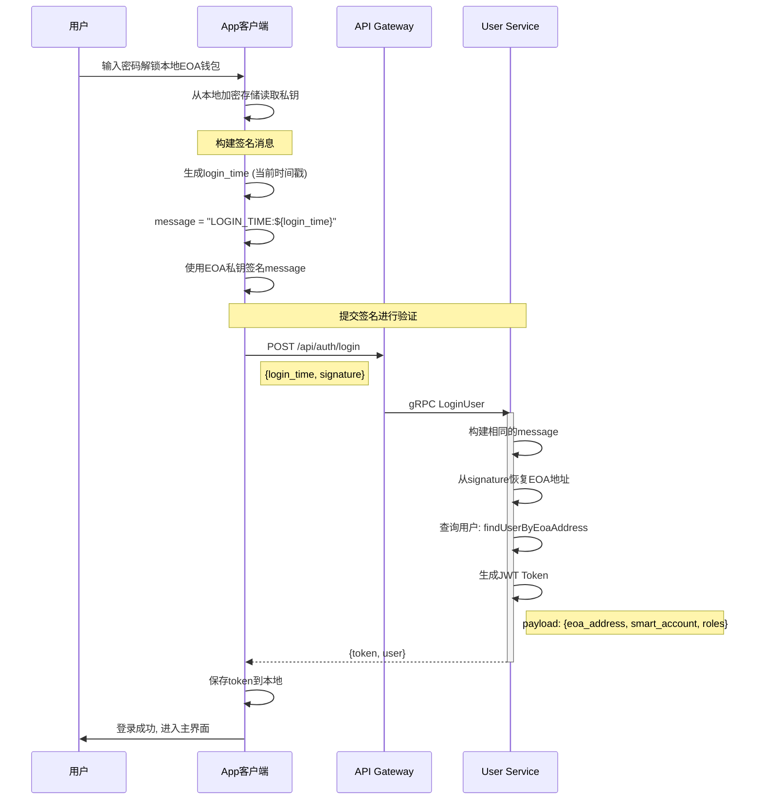

---

##### **图 6：关系暂停/恢复/撤销 ✅**

**流程描述**: 老人可以灵活管理与联系人的关系状态。

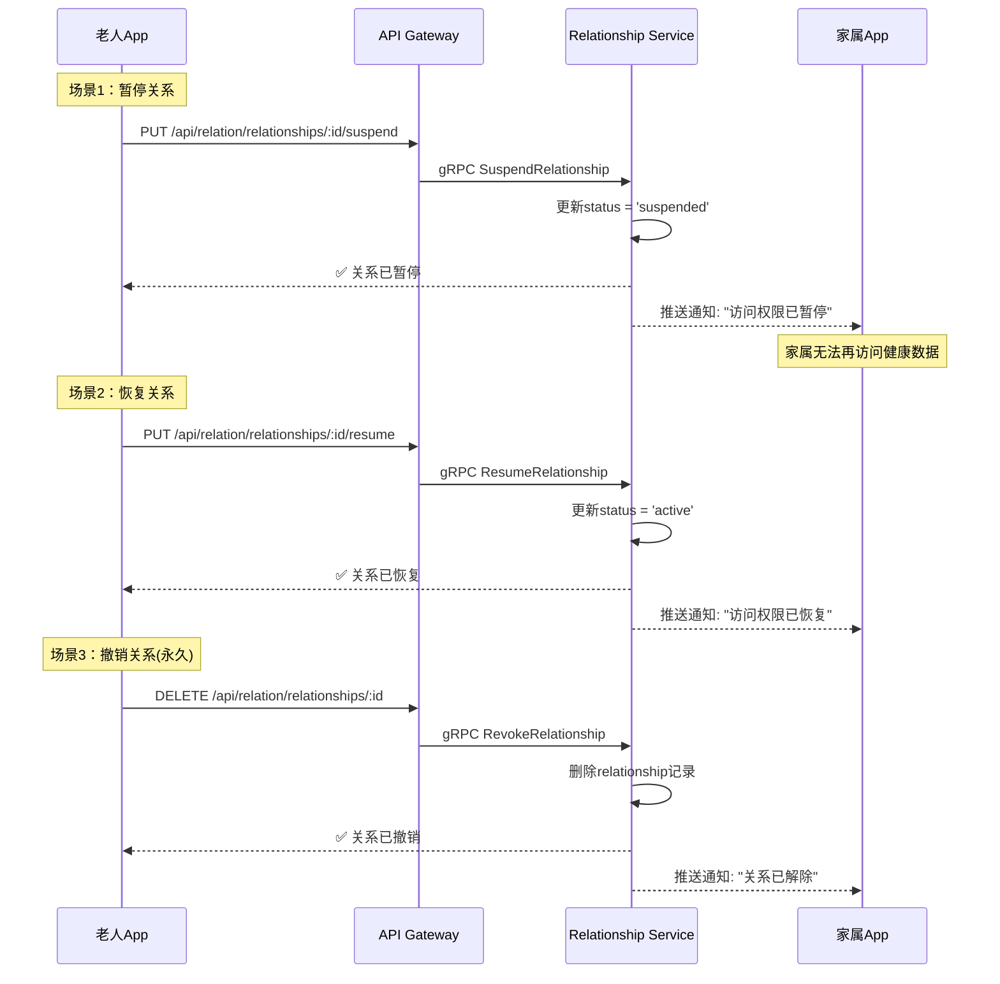

---

##### **图 7：账户迁移 (设备更换) ✅**

**流程描述**: 用户更换设备时的安全账户迁移流程。

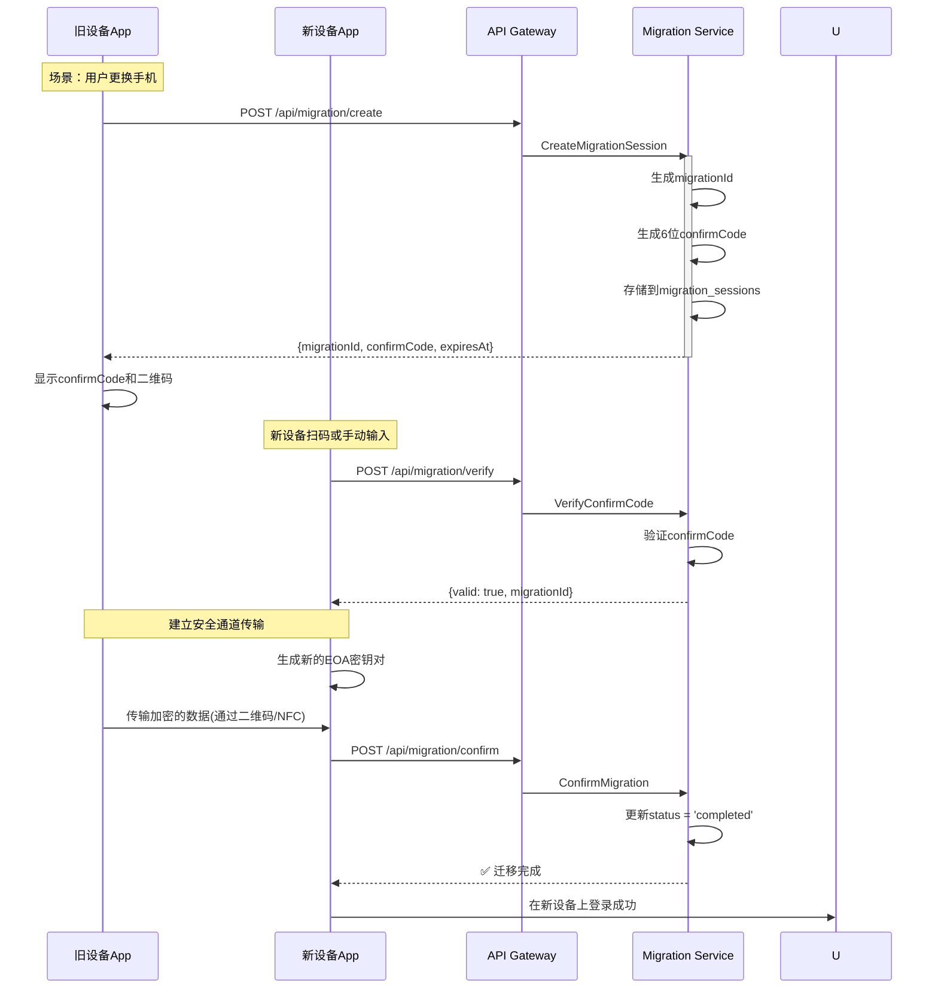

---

#### **阶段二：规划中的ZKP流程**

##### **图 8：日常打卡与ZKP证明生成 🚧规划中**

**流程描述**: 老人打卡后，在本地生成零知识证明，确保隐私。

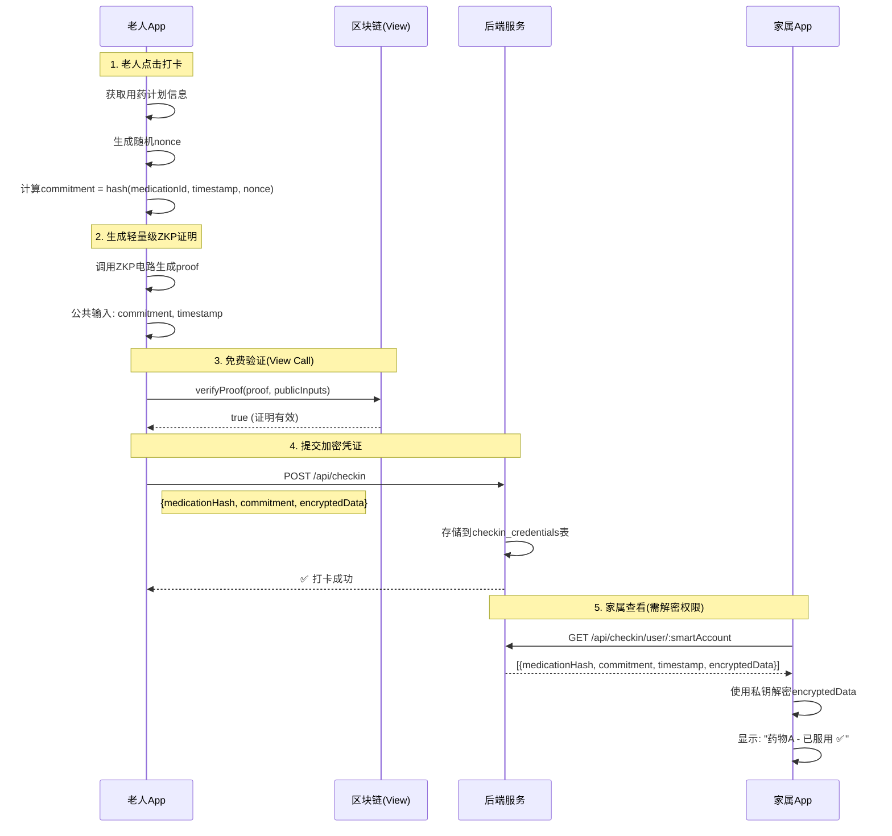

---

##### **图 9：周度汇总与上链 🚧规划中**

**流程描述**: 每周末，将打卡记录聚合成默克尔根，提交上链形成不可篡改档案。

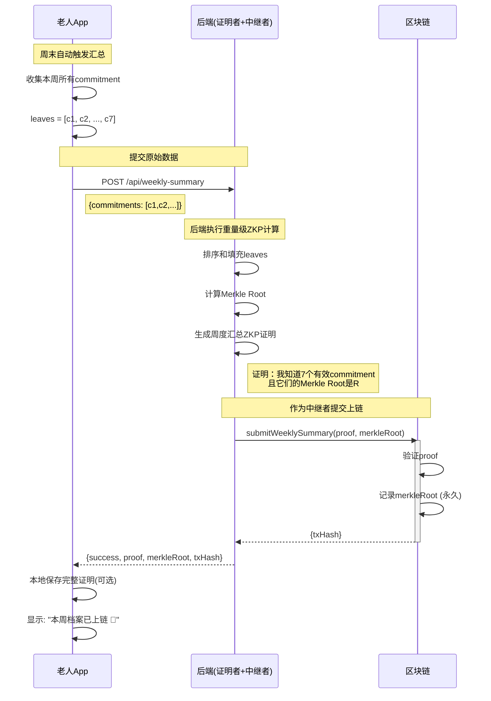

---

##### **图 10：隐私保护的AI分析 🚧规划中**

**流程描述**: 利用云端AI算力，同时确保敏感数据不出端。

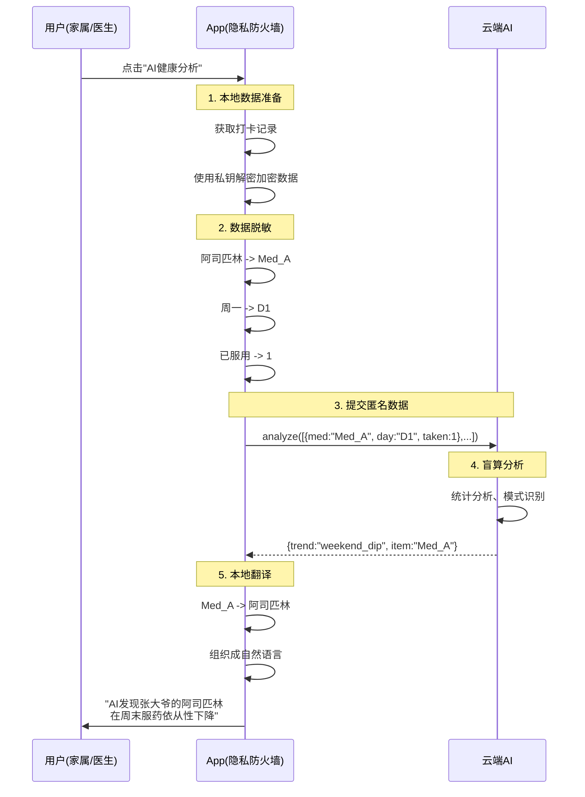

---

#### **第五部分：技术栈与实现细节**

##### **5.1 已实现的技术栈**

**前端 (规划中)**:
- Vue 3 + Capacitor (跨平台移动应用)
- ethers.js (以太坊交互)
- TypeScript

**后端微服务**:
- Node.js + Express (API Gateway)
- gRPC (微服务通信)
- PostgreSQL (关系数据库)
- Redis (缓存/会话/任务状态)
- RabbitMQ (消息队列/事件驱动)
- WebSocket (实时通知推送)

**区块链**:
- Solidity (智能合约)
- ERC4337 标准 (账户抽象)
- Hardhat (开发环境)
- ethers.js (链交互)

##### **5.2 规划中的技术栈**

**零知识证明** ✅:
- Circom (ZKP电路开发)
- SnarkJS (证明生成/验证) - 已集成
- Groth16 (证明系统) - 已实现
- 异步任务处理 (后端重量级计算)

**加密**:
- ECIES (非对称加密)
- AES-256-GCM (对称加密)
- Keccak-256 (哈希函数)

##### **5.3 系统安全特性**

1. **私钥安全** ✅:
   - 私钥永不上传服务器
   - 本地加密存储
   - 两步式签名流程

2. **零Gas费用** ✅:
   - Paymaster代付所有交易
   - 用户无需持有ETH

3. **社交恢复** ✅:
   - 无需助记词
   - 守护者投票机制
   - 阈值可配置

4. **细粒度权限** ✅:
   - 访问组隔离
   - 关系可暂停/恢复
   - 实时权限变更

5. **零知识证明** 🚧:
   - 数据所有权
   - 隐私保护
   - 可验证计算

##### **5.4 数据库连接配置**

```
PostgreSQL (端口 5400):
- bs_gateway_db (网关权限)
- bs_user_service_db (用户服务)
- bs_relationship_db (关系服务)
- bs_userinfo_db (个人档案)
- bs_secure_exchange_db (安全交换)
- bs_medication_db (用药管理) ✅ 新增
- migration_db (迁移服务)
- bs_notification_db (通知服务)

Redis (端口 6379):
- 会话缓存
- Token黑名单
- WebSocket在线状态
- ZKP任务状态
- Medication Service缓存

RabbitMQ (端口 5672):
- 服务间异步通信
- 通知事件分发（Topic Exchange）
- 优先级队列（high/normal/low）
- 用药计划加密传输
```

---

#### **第六部分：API接口总览**

##### **6.1 公开接口 (无需认证)**

**用户认证**:
- `POST /api/auth/register` - 用户注册
- `POST /api/auth/login` - 用户登录

**ERC4337服务**:
- `POST /api/erc4337/account` - 创建账户
- `POST /api/erc4337/account/address` - 预计算地址
- `POST /api/erc4337/guardian/build` - 构建添加守护者UserOp
- `POST /api/erc4337/guardian/submit` - 提交已签名UserOp
- `POST /api/erc4337/recovery/initiate/build` - 构建发起恢复UserOp
- `POST /api/erc4337/recovery/support/build` - 构建支持恢复UserOp
- `POST /api/erc4337/recovery/submit` - 提交恢复UserOp
- `GET /api/erc4337/guardian/:address` - 查询守护者

**个人档案**:
- `GET /api/userinfo/api/persons/lookup` - 身份验证查询

**账户迁移**:
- `POST /api/migration/create` - 创建迁移会话
- `POST /api/migration/verify` - 验证确认码
- `POST /api/migration/confirm` - 确认迁移

##### **6.2 受保护接口 (需要JWT认证)**

**通知服务** ✅:
- `GET /api/notification/notifications` - 获取通知列表
- `GET /api/notification/notifications/unread/count` - 获取未读数量
- `PUT /api/notification/notifications/:id/read` - 标记已读
- `PUT /api/notification/notifications/read-all` - 全部标记已读
- `DELETE /api/notification/notifications/:id` - 删除通知
- `WS /ws/notification` - WebSocket实时推送（需JWT认证）

**ZKP服务** ✅:
- `POST /api/zkp/prove/weekly-summary` - 启动周度汇总证明任务
- `GET /api/zkp/proof-status/:jobId` - 查询证明任务状态
- `GET /api/zkp/health` - ZKP服务健康检查

**用药管理服务** ✅:
- `GET /api/medication/categories` - 获取药物分类列表
- `GET /api/medication/common` - 搜索常用药物（支持search、category参数）
- `POST /api/medication/plans` - 创建用药计划（医生）
- `GET /api/medication/plans/:planId` - 查询计划详情
- `GET /api/medication/plans/patient/:address` - 查询患者的所有计划
- `GET /api/medication/plans/doctor/:address` - 查询医生创建的计划
- `PUT /api/medication/plans/:planId` - 更新用药计划（医生）
- `DELETE /api/medication/plans/:planId` - 删除用药计划
- `POST /api/medication/plans/:planId/share` - 老人分享计划到访问组
- `DELETE /api/medication/plans/:planId/share/:recipientAddress` - 撤销分享
- `GET /api/medication/plans/:planId/share-status` - 查询分享状态

**访问组管理**:
- `POST /api/relation/access-groups` - 创建访问组
- `GET /api/relation/access-groups` - 获取我的访问组
- `GET /api/relation/access-groups/stats` - 获取访问组详情
- `GET /api/relation/access-groups/:id/members` - 获取成员列表

**邀请管理**:
- `POST /api/relation/invitations` - 创建标准邀请
- `POST /api/relation/invitations/hospital` - 创建医院邀请
- `GET /api/relation/invitations/my` - 获取我的邀请
- `DELETE /api/relation/invitations/cancel` - 取消邀请

**关系管理**:
- `POST /api/relation/relationships/accept` - 接受邀请
- `PUT /api/relation/relationships/:id/suspend` - 暂停关系
- `PUT /api/relation/relationships/:id/resume` - 恢复关系
- `DELETE /api/relation/relationships/:id` - 撤销关系

##### **6.3 规划中的接口**

**用药打卡** 🚧:
- `POST /api/checkin` - 提交打卡凭证
- `GET /api/checkin/user/:smartAccount` - 查询打卡记录
- `GET /api/checkin/verify` - 验证打卡证明

**周度汇总** 🚧:
- `POST /api/weekly-summary` - 提交周度汇总
- `GET /api/weekly-summary/:smartAccount` - 查询上链记录

---

#### **第七部分：部署与运维**

##### **7.1 服务启动顺序**

```bash
# 1. 基础设施
docker-compose up -d postgres redis rabbitmq

# 2. 区块链节点
cd smart-contracts && npx hardhat node

# 3. 后端服务
./start-all-services.ps1

# 或手动启动:
cd api-gateway && npm start         # 3000 (HTTP Gateway)
cd user-service && npm start        # 3001 (HTTP) + 50051 (gRPC)
cd erc4337-service && npm start     # 3002 (HTTP) + 50053 (gRPC)
cd zkp-service && npm start         # 3003 (HTTP)
cd relationship-service && npm start # 3004 (HTTP) + 50052 (gRPC)
cd notification-service && npm start # 3005 (HTTP + WebSocket)
cd secure-exchange-service && npm start # 3006 (HTTP) + 50056 (gRPC)
cd medication-service && npm start  # 3007 (HTTP) + 50057 (gRPC) ✅ 新增
cd migration-service && npm start   # 3008 (HTTP)
cd userinfo-service && npm start    # 5000 (HTTP)

# 4. 前端应用 (规划中)
cd mobile-app && npm run dev
```

##### **7.2 健康检查**

```bash
# API Gateway
curl http://localhost:3000/health

# User Service
curl http://localhost:3001/api/health

# ERC4337 Service
curl http://localhost:3002/health

# ZKP Service
curl http://localhost:3003/api/health

# Relationship Service
curl http://localhost:3004/api/health

# Notification Service
curl http://localhost:3005/api/health

# Secure Exchange Service
curl http://localhost:3006/api/health

# Medication Service ✅ 新增
curl http://localhost:3007/api/health

# Migration Service
curl http://localhost:3008/health

# Userinfo Service
curl http://localhost:5000/health
```

##### **7.3 监控指标**

**性能指标**:
- API响应时间 < 200ms
- gRPC调用延迟 < 50ms
- 区块链交易确认 < 15s

**可用性指标**:
- 服务可用性 > 99.9%
- 数据库连接池利用率 < 80%
- Redis缓存命中率 > 90%

---

#### **第八部分：测试与验证**

##### **8.1 已完成的测试**

**E2E测试** ✅:
- 完整关系管理流程测试
  - 位置: `api-gateway/tests/e2e-relationship-flow.test.js`
  - 覆盖: 访问组、邀请、关系管理全流程
- 通知服务集成测试
  - 位置: `api-gateway/tests/e2e-notification-flow.test.js`
  - 覆盖: WebSocket推送、HTTP API、消息队列
- 安全传输服务集成测试
  - 位置: `api-gateway/tests/e2e-secure-exchange-flow.test.js`
  - 覆盖: 端到端加密数据传输、公钥交换
- 用药管理服务集成测试 ✅ 新增
  - 位置: `api-gateway/tests/e2e-medication-flow.test.js`
  - 覆盖: 药物搜索、计划管理、加密分享、状态管理、提醒功能
- ZKP服务集成测试
  - 位置: `zkp-service/tests/test-zkp-integration.js`
  - 覆盖: 证明生成、任务状态查询、认证测试

**API测试** ✅:
- HTTP测试文件: `*/httpTest/*.http`
- 使用VS Code REST Client插件执行

**性能测试** ✅:
- ZKP证明生成: weeklySummary电路测试通过
- WebSocket并发连接测试通过

##### **8.2 规划中的测试**

**ZKP性能测试** 🚧:
- 轻量级证明生成时间 (目标: < 5s)
- 重量级证明生成时间 (服务器端)
- 移动设备性能基准测试

**安全测试** 🚧:
- 签名重放攻击防护
- 权限越权测试
- 加密强度验证

---

#### **第九部分：项目进度与里程碑**

##### **9.1 Phase 1: 基础设施与身份层 ✅ 已完成**

**完成时间**: 2025年10月中旬
**完成功能**:
- [x] ERC4337账户抽象系统
- [x] 社交恢复机制（守护者管理、账户恢复）
- [x] 用户认证与授权（JWT + RBAC）
- [x] 访问组权限管理（细粒度权限控制）
- [x] 关系管理系统（邀请、暂停、恢复、撤销）
- [x] 账户迁移服务（设备间安全迁移）
- [x] 个人档案服务（身份验证）
- [x] 微服务架构搭建（9个微服务）
- [x] API Gateway统一入口（支持WebSocket代理）
- [x] 消息通知服务（WebSocket + RabbitMQ + 多渠道推送）
- [x] ZKP证明生成服务（后端异步计算）
- [x] 安全数据传输服务（端到端加密）
- [x] 完整的E2E测试套件（4个流程测试）

##### **9.2 Phase 2: 应用层与数据管理 ✅ 部分完成 / 🚧 进行中**

**完成时间**: 2025年10月下旬开始
**已完成** ✅:
- [x] ZKP证明生成服务（后端异步计算）
- [x] weeklySummary电路集成测试
- [x] **用药管理系统** ✅ 新完成 (2025年10月30日)
  - [x] 常用药物库（150种药物，9大分类）
  - [x] 用药计划管理（创建、查询、更新、删除）
  - [x] 药物条目管理（支持多药物计划）
  - [x] 计划加密分享功能（基于访问组）
  - [x] 与Secure Exchange Service集成（端到端加密传输）
  - [x] 计划状态管理（active/paused/completed/cancelled）
  - [x] 完整的E2E测试（1028行测试代码）
  - [x] API Gateway集成和路由配置
- [x] 安全数据传输基础设施
- [x] 加密密钥交换机制

**进行中** 🚧:
- [ ] 前端ZKP电路集成（轻量级）
- [ ] 用药打卡证明生成（客户端）
- [ ] 用药提醒推送功能
- [ ] 用药记录和依从性统计
- [ ] 周度汇总上链（ERC4337集成）
- [ ] 移动端ZKP性能优化

**待开始** 📋:
- [ ] 移动端App开发（Vue + Capacitor）
- [ ] 用药打卡UI界面

##### **9.3 Phase 3: 应用层与AI 🚧 未来计划**

**预计时间**: 2026年2月 - 2026年6月
**规划功能**:
- [ ] 移动App开发 (Vue + Capacitor)
- [ ] 用药方案管理
- [ ] 实时提醒与警报
- [ ] 隐私保护的AI分析
- [ ] 数据可视化

##### **9.4 Phase 4: 生态与推广 🚧 未来计划**

**预计时间**: 2026年7月起
**规划功能**:
- [ ] 医院系统对接
- [ ] 多语言支持
- [ ] 去中心化存储 (IPFS)
- [ ] 跨链互操作
- [ ] 社区治理

---

#### **第十部分：技术难点与解决方案**

##### **10.1 已解决的技术挑战**

**挑战1: 私钥安全问题**
- **问题**: 如何在不上传私钥的情况下执行链上操作?
- **解决**: 采用两步式流程 (build + sign + submit)
- **状态**: ✅ 已实现

**挑战2: Gas费用障碍**
- **问题**: 老年用户不懂得如何获取ETH支付Gas?
- **解决**: Paymaster代付所有交易费用
- **状态**: ✅ 已实现

**挑战3: 助记词易丢失**
- **问题**: 老年人容易忘记助记词导致账户永久丢失?
- **解决**: 社交恢复机制，通过守护者恢复账户
- **状态**: ✅ 已实现

**挑战4: 权限管理复杂**
- **问题**: 如何实现细粒度的数据访问控制?
- **解决**: 访问组 + 邀请机制 + 关系状态管理
- **状态**: ✅ 已实现

##### **10.2 待解决的技术挑战**

**挑战5: 移动端ZKP性能**
- **问题**: 移动设备生成ZKP证明可能耗时过长
- **方案**: 
  - 轻量级证明在客户端生成 (< 5s) - 🚧 待实现
  - 重量级证明在服务器端生成 - ✅ 已实现
  - 异步任务处理 + 实时通知
- **状态**: ✅ 服务端已完成

**挑战6: 链下数据可信性**
- **问题**: 后端存储的加密凭证可能被篡改?
- **方案**: 
  - 定期批量上链
  - 默克尔证明验证
- **状态**: 🚧 设计中

---

#### **第十一部分：安全模型分析**

##### **11.1 威胁模型**

**假设的攻击者能力**:
1. 攻击者可以完全控制后端服务器
2. 攻击者可以监听所有网络流量
3. 攻击者不能破解密码学原语 (ECC, AES, Hash)
4. 攻击者不能物理访问用户设备

##### **11.2 安全保证**

**已实现的安全保证** ✅:

1. **身份安全**: 
   - 私钥永不离开设备
   - 基于签名的身份验证
   - 社交恢复防止账户丢失

2. **传输安全**:
   - HTTPS/TLS加密
   - 签名验证防止中间人攻击

3. **权限安全**:
   - JWT Token有效期限制
   - 细粒度访问控制
   - 实时权限撤销

4. **合约安全**:
   - 守护者阈值机制
   - 恢复时间锁
   - Paymaster额度限制

**规划中的安全保证** 🚧:

5. **数据隐私** (ZKP层):
   - 零知识证明隐藏原始数据
   - 端到端加密防止未授权访问
   - 即使服务器被攻破，也无法读取健康数据

6. **数据完整性** (区块链层):
   - 周度汇总上链防篡改
   - 默克尔证明验证历史记录

---

#### **第十二部分：结论与展望**

##### **12.1 项目成果总结**

本项目成功搭建了一个**完整的去中心化身份与权限管理基础设施**，并完成了**用药管理核心业务系统**，为隐私保护的健康数据管理奠定了坚实基础：

**✅ 技术创新**:
1. 首个将ERC4337账户抽象应用于医疗场景的实践
2. 零Gas费用的用户体验，降低Web3使用门槛
3. 社交恢复机制，解决老年人助记词管理难题
4. 细粒度访问组权限系统，实现精准数据共享
5. 端到端加密的用药计划传输，保护医疗隐私 ✅ 新增

**✅ 架构优势**:
1. 微服务架构，易于扩展和维护（已完成9个核心微服务）
2. 前后端分离，清晰的职责划分
3. 多层安全防护，纵深防御
4. 标准化API接口，易于集成
5. 完整的E2E测试覆盖（4个完整流程测试） ✅ 新增

**✅ 实用价值**:
1. 真正的用户数据主权
2. 可信的健康记录证明
3. 灵活的权限管理
4. 无缝的账户恢复
5. 完整的用药计划管理（150种常用药物库） ✅ 新增
6. 老人主导的隐私控制（主动分享机制） ✅ 新增

**✅ 最新里程碑 (2025年10月31日)**:
- 完成用药管理系统（Medication Service）
- 实现150种常用药物数据库
- 集成端到端加密数据传输
- 完成1028行E2E测试代码
- 支持医生-患者-家属三方协作
- 实现基于访问组的计划分享机制

##### **12.2 下一步计划**

**短期 (1-3个月内)**:
1. ✅ ~~完成用药管理系统后端~~ **已完成**
2. 完成移动端App开发（Vue + Capacitor）
3. 实现用药提醒推送功能
4. 开发用药打卡UI界面
5. 实现轻量级ZKP打卡功能（客户端）
6. 完善用药记录和依从性统计
7. 进行小规模用户测试

**中期 (3-9个月)**:
1. 实现周度汇总上链
2. 开发AI健康分析功能（隐私保护）
3. 对接试点医院系统
4. 完善监控与运维体系
5. 药物相互作用检查功能
6. 用药记录数据分析与可视化

**长期 (1-2年)**:
1. 推广到更多医疗机构
2. 研究跨链互操作方案
3. 探索去中心化存储（IPFS集成）
4. 建设开发者生态
5. 多语言国际化支持

##### **12.3 社会影响**

本项目的成功实施将产生深远的社会影响：

1. **提升老龄化社会的医疗质量**: 通过技术手段解决用药依从性难题
2. **保护公民隐私权**: 让用户真正掌控自己的健康数据
3. **降低Web3使用门槛**: 为非技术用户提供无感知的区块链体验
4. **推动医疗数据标准化**: 为行业提供可参考的隐私保护方案

##### **12.4 致谢**

感谢所有参与本项目的开发者、测试人员和顾问专家。特别感谢以太坊社区提供的ERC4337标准，以及零知识证明领域的先驱研究。

---

**项目仓库**: [GitHub - Elder Medical ZKP Project](https://github.com/your-repo)
**文档更新时间**: 2025年10月31日
**联系方式**: [项目负责人邮箱]

**最新更新**: 
- ✅ 完成用药管理系统（Medication Service）
- ✅ 集成安全数据传输（Secure Exchange Service）
- ✅ 完整的E2E测试套件（包含用药管理流程测试）

---

## 附录

### 附录A: 术语表

- **EOA**: Externally Owned Account，外部账户，由私钥控制
- **Smart Account**: 智能合约账户，基于ERC4337的抽象账户
- **UserOperation**: ERC4337中的用户操作，类似于交易
- **Paymaster**: Gas代付合约，为用户支付交易费用
- **守护者**: 社交恢复机制中帮助用户恢复账户的可信联系人
- **访问组**: 权限管理的基本单位，决定谁能访问特定数据
- **ZKP**: Zero-Knowledge Proof，零知识证明
- **端到端加密**: 数据在发送端加密，只有接收端能解密，中间服务器无法读取

### 附录B: 快速启动命令

```bash
# 克隆项目
git clone https://github.com/your-repo/elder-medical-zkp.git
cd elder-medical-zkp

# 启动基础设施
docker-compose up -d

# 安装依赖
npm run install:all

# 启动所有服务 (Windows)
.\start-all-services.ps1

# 启动所有服务 (Linux/Mac)
./start-all-services.sh

# 健康检查
curl http://localhost:3000/health
```

### 附录C: 环境变量配置示例

```env
# API Gateway
PORT=3000
JWT_SECRET=your_strong_secret_key_here
CORS_ALLOWED_ORIGINS=http://localhost:5173,http://localhost:8100

# Database
DB_HOST=localhost
DB_PORT=5400
DB_USER=root
DB_PASSWORD=123456

# Redis
REDIS_URL=redis://localhost:6379

# RabbitMQ
MQ_URL=amqp://localhost:5672

# Blockchain
ETH_NODE_URL=http://localhost:8545
PRIVATE_KEY=your_server_private_key_here
```

### 附录D: 常见问题FAQ

**Q1: 为什么需要两个地址 (EOA和Smart Account)?**
A: EOA用于签名，Smart Account是用户在系统中的身份标识。这种设计既保证了安全性（私钥签名），又提供了可扩展性（合约账户）。

**Q2: 如果所有守护者都不可用怎么办?**
A: 这是社交恢复的固有限制。建议用户至少设置3个守护者，并设置阈值为2，降低单点故障风险。

**Q3: Paymaster的资金耗尽怎么办?**
A: 系统会监控Paymaster余额，低于阈值时发送告警。运维人员需要定期充值。

**Q4: ZKP证明生成为什么有些在客户端，有些在服务器端?**
A: 轻量级证明（如日常打卡）在客户端生成，确保隐私和响应速度。重量级证明（如周度汇总）因计算复杂度高，在服务器端异步生成，通过推送通知返回结果。

**Q5: 数据存储在哪里?**
A: 私钥和解密后的敏感数据存储在客户端本地；加密的健康数据存储在后端数据库（后端不可解密）；零知识证明和默克尔根存储在区块链。三层存储，各司其职。

---

**文档结束**
