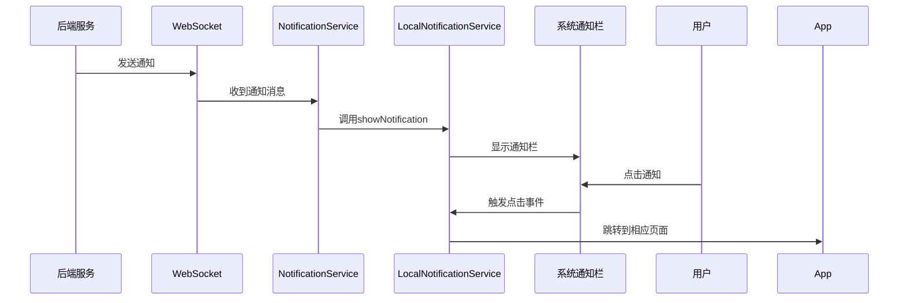

# 手机通知栏集成指南

> 版本: v1.0  
> 更新日期: 2025-10-31

---

## 📋 功能说明

当应用接收到WebSocket通知时，会自动在手机的通知栏显示通知，用户点击通知可以直接跳转到相应页面。

---

## 🔧 实现内容

### 1. **安装的插件**

```bash
npm install @capacitor/local-notifications
npx cap sync android
```

已安装 `@capacitor/local-notifications@7.0.3`

### 2. **创建的服务**

📄 `src/service/localNotification.ts`

**核心功能**:
- ✅ 请求和检查通知权限
- ✅ 显示单条/批量通知
- ✅ 创建通知渠道（Android 8.0+）
- ✅ 注册通知点击监听器
- ✅ 取消通知

**通知渠道**:
| 渠道ID | 名称 | 优先级 | 声音 | 震动 |
|-------|------|--------|------|------|
| urgent | 紧急通知 | 5（最高） | ✅ | ✅ |
| high | 高优先级通知 | 4 | ✅ | ✅ |
| normal | 普通通知 | 3 | ✅ | ❌ |

### 3. **集成到WebSocket**

📄 `src/service/notification.ts`

在收到WebSocket通知时自动调用:
```typescript
private async showLocalNotification(notification: Notification): Promise<void> {
  await localNotificationService.showNotification(notification)
}
```

### 4. **App启动初始化**

📄 `src/main.ts`

启动时自动执行:
- ✅ 创建通知渠道
- ✅ 检查通知权限
- ✅ 注册点击监听器

### 5. **WebSocket自动连接**

📄 `src/views/core/Home.vue`

首页加载时自动连接WebSocket:
```typescript
onMounted(async () => {
  await notificationService.connect()
  console.log('✅ 通知服务已启动')
})
```

---

## 📱 通知流程



---

## 🎨 通知样式

### 通知内容格式

```
[图标] 标题
内容正文
```

示例:
```
💊 用药提醒
该吃晚饭后的降压药了
```

### 图标映射

| 通知类型 | 图标 | 说明 |
|---------|------|------|
| medication_reminder | 💊 | 用药提醒 |
| new_medication_plan | 📋 | 新用药计划 |
| relationship_invitation_accepted | ✅ | 新成员加入 |
| relationship_joined_group | 👋 | 加入成功 |
| migration_completed | ✨ | 迁移完成 |
| recovery_request_received | 🆘 | 恢复请求 |
| encrypted_message | 💬 | 加密消息 |
| system_notification | 🔔 | 系统通知 |

---

## 🔔 通知权限管理

### 权限请求流程

1. **App启动时**: 检查是否已授予权限
2. **首次收到通知时**: 如果未授予，自动请求权限
3. **用户操作**: 用户可以在系统设置中管理权限

### 权限状态

```typescript
// 检查权限
const granted = await localNotificationService.checkPermission()
console.log('通知权限:', granted ? '已授予' : '未授予')

// 请求权限
const granted = await localNotificationService.requestPermission()
if (granted) {
  console.log('用户授予了通知权限')
} else {
  console.log('用户拒绝了通知权限')
}
```

---

## 📍 点击跳转逻辑

当用户点击通知时，根据通知类型自动跳转:

| 通知类型 | 跳转页面 |
|---------|---------|
| medication_* | `/medication-history` |
| relationship_* | `/relationships` |
| migration_* | `/account-migration` |
| 其他 | `/notifications` |

实现代码 (`main.ts`):
```typescript
localNotificationService.registerClickListener((notification) => {
  const type = notification.extra?.type
  
  if (type?.includes('medication')) {
    router.push('/medication-history')
  } else if (type?.includes('relationship')) {
    router.push('/relationships')
  } else if (type?.includes('migration')) {
    router.push('/account-migration')
  } else {
    router.push('/notifications')
  }
})
```

---

## ⚙️ 配置选项

### 通知优先级

通知会根据后端返回的 `priority` 字段自动分配到不同渠道:

```typescript
urgent → urgent渠道 (最高优先级，有声音和震动)
high → high渠道 (高优先级，有声音和震动)
normal → normal渠道 (普通优先级，仅声音)
```

### 自定义通知

如需自定义通知样式，可修改 `localNotification.ts`:

```typescript
const localNotification: LocalNotificationSchema = {
  id: this.notificationId++,
  title: notification.title,
  body: notification.body,
  // 添加大图标
  largeIcon: 'res://drawable/notification_large',
  // 自定义声音
  sound: 'custom_sound.wav',
  // 添加动作按钮
  actionTypeId: 'CUSTOM_ACTION',
  // 自定义小图标
  smallIcon: 'ic_stat_custom'
}
```

---

## 🐛 调试技巧

### 查看通知权限状态

```typescript
const result = await LocalNotifications.checkPermissions()
console.log('通知权限状态:', result.display)
// granted - 已授予
// denied - 已拒绝
// prompt - 未请求
```

### 查看待显示的通知

```typescript
const pending = await LocalNotifications.getPending()
console.log('待显示通知:', pending.notifications)
```

### 测试通知显示

在浏览器控制台或代码中:

```typescript
import { localNotificationService } from '@/service/localNotification'

// 测试显示通知
localNotificationService.showNotification({
  notification_id: 'test_001',
  title: '测试通知',
  body: '这是一条测试通知',
  type: 'system_notification',
  priority: 'high',
  recipient_address: '0x...',
  channels: ['push'],
  status: 'sent',
  created_at: new Date().toISOString()
})
```

---

## 📱 Android配置

### AndroidManifest.xml

Capacitor已自动添加以下权限:

```xml
<uses-permission android:name="android.permission.POST_NOTIFICATIONS" />
<uses-permission android:name="android.permission.VIBRATE" />
```

### 通知图标

放置通知图标文件:
```
android/app/src/main/res/
  ├── drawable/
  │   └── ic_stat_notifications.png (白色透明图标)
  ├── drawable-mdpi/
  ├── drawable-hdpi/
  ├── drawable-xhdpi/
  ├── drawable-xxhdpi/
  └── drawable-xxxhdpi/
```

**图标要求**:
- 格式: PNG
- 颜色: 白色 (#FFFFFF)
- 背景: 透明
- 尺寸: 24x24 dp
- 样式: 扁平化、简洁

---

## 🔧 常见问题

### 1. 通知不显示

**检查清单**:
- ✅ 是否已授予通知权限？
- ✅ WebSocket是否已连接？
- ✅ 是否有错误日志？
- ✅ Android版本是否≥8.0且已创建渠道？

**解决方案**:
```typescript
// 手动请求权限
await localNotificationService.requestPermission()

// 检查WebSocket状态
console.log('WebSocket状态:', notificationService.ws?.readyState)
// 1 = OPEN（已连接）

// 重新创建渠道
await localNotificationService.createChannels()
```

### 2. 通知权限被拒绝

如果用户拒绝了权限，需要引导用户到系统设置:

```typescript
import { App } from '@capacitor/app'

// 打开应用设置
await App.openUrl({ url: 'app-settings:' })
```

### 3. 点击通知不跳转

确保在 `main.ts` 中注册了点击监听器:

```typescript
localNotificationService.registerClickListener((notification) => {
  console.log('通知被点击:', notification)
  // 跳转逻辑...
})
```

### 4. 通知声音不播放

确保:
- ✅ 设备静音模式已关闭
- ✅ 应用通知权限包含声音
- ✅ 通知渠道已启用声音

---

## 🚀 测试步骤

### 1. 构建并安装App

```bash
npm run build
npx cap sync android
npx cap open android
```

在Android Studio中运行应用。

### 2. 测试通知权限

1. 打开应用
2. 查看控制台日志，确认权限状态
3. 如果未授予，会在首次收到通知时请求

### 3. 测试实时通知

1. 确保应用已连接到后端
2. 从后端发送测试通知
3. 观察手机通知栏是否显示
4. 点击通知，验证跳转是否正确

### 4. 测试后台通知

1. 最小化应用或切换到其他应用
2. 发送测试通知
3. 验证通知栏是否显示
4. 点击通知，验证应用是否打开并跳转

---

## 📊 性能优化

### 1. 通知去重

如果短时间内收到多条相同通知，可以合并:

```typescript
// 记录最近显示的通知
const recentNotifications = new Set()

if (!recentNotifications.has(notification.notification_id)) {
  await localNotificationService.showNotification(notification)
  recentNotifications.add(notification.notification_id)
  
  // 5秒后清除记录
  setTimeout(() => {
    recentNotifications.delete(notification.notification_id)
  }, 5000)
}
```

### 2. 限制通知数量

避免通知栏被刷屏:

```typescript
// 限制每分钟最多显示5条通知
const notificationCount = 0
const resetTime = Date.now() + 60000

if (Date.now() > resetTime) {
  notificationCount = 0
  resetTime = Date.now() + 60000
}

if (notificationCount < 5) {
  await localNotificationService.showNotification(notification)
  notificationCount++
}
```

---

## 🎯 未来扩展

### 计划功能

1. **分组通知**: 将相同类型的通知分组显示
2. **富文本通知**: 支持图片、按钮等
3. **通知历史**: 在应用内查看历史通知
4. **免打扰模式**: 允许用户设置免打扰时段
5. **通知过滤**: 允许用户选择接收哪些类型的通知
6. **通知统计**: 显示通知的到达率和点击率

---

## 📞 技术支持

如遇问题，请检查:

1. **权限**: Settings > Apps > [Your App] > Notifications
2. **日志**: 查看Logcat输出
3. **版本**: Android 8.0+ 才支持通知渠道
4. **后端**: 确认后端正确发送通知

---

## 版本历史

- **v1.0** (2025-10-31): 初始实现
  - 基础通知显示
  - 通知渠道管理
  - 点击跳转功能
  - WebSocket集成

