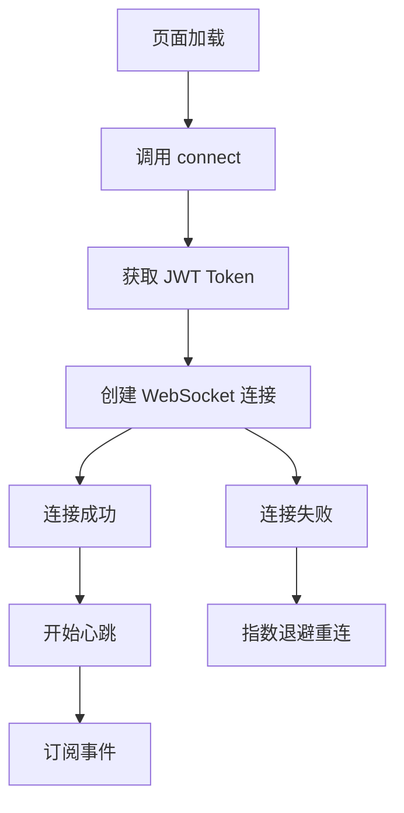

# 通知功能实现指南

> 版本: v1.0  
> 更新日期: 2025-10-31

---

## 📋 实现内容

### 1. **API配置**
📄 `src/config/api.config.ts`

新增配置:
```typescript
export const NOTIFICATION_CONFIG = {
  baseUrl: API_GATEWAY_URL,
  wsUrl: `ws://${BACKEND_IP}:${API_GATEWAY_PORT}/ws/notification`,
  endpoints: {
    getNotifications: '/notification/notifications',
    getUnreadCount: '/notification/notifications/unread/count',
    markAsRead: '/notification/notifications/:notificationId/read',
    markAllRead: '/notification/notifications/read-all',
    deleteNotification: '/notification/notifications/:notificationId',
  },
}

export function buildNotificationUrl(
  endpoint: keyof typeof NOTIFICATION_CONFIG.endpoints,
  params?: Record<string, string | number>
): string
```

### 2. **通知服务**
📄 `src/service/notification.ts`

#### 核心功能:

**WebSocket管理**:
- ✅ 自动连接和重连（指数退避策略）
- ✅ 心跳机制（每30秒）
- ✅ 事件订阅系统
- ✅ 优雅断开连接

**HTTP API**:
- ✅ `getNotifications(options)` - 获取通知列表
- ✅ `getUnreadCount()` - 获取未读数量
- ✅ `markAsRead(notificationId)` - 标记单条已读
- ✅ `markAllRead()` - 标记全部已读
- ✅ `deleteNotification(notificationId)` - 删除通知

**事件系统**:
```typescript
notificationService.on('notification', (data) => {
  // 处理新通知
})

notificationService.on('connected', (data) => {
  // WebSocket连接成功
})

notificationService.on('error', (data) => {
  // 错误处理
})
```

### 3. **通知页面**
📄 `src/views/management/Notifications.vue`

#### 特性:

**UI组件**:
- ✅ 通知统计卡片（总数、未读、系统消息）
- ✅ 类型筛选（全部、用药、关系、系统）
- ✅ 通知列表（带未读标记）
- ✅ 加载和错误状态
- ✅ 空状态提示

**交互功能**:
- ✅ 点击标记已读
- ✅ 批量标记全部已读
- ✅ 点击查看详情（跳转到相应页面）
- ✅ 实时接收新通知（WebSocket）

**通知类型映射**:
```typescript
medication_reminder → 用药 💊
relationship_* → 关系 👥
migration_* → 系统 🔔
system_notification → 系统 🔔
encrypted_message → 消息 💬
```

---

## 🔌 WebSocket使用流程

### 连接流程



### 使用示例

```typescript
// 1. 连接WebSocket
await notificationService.connect()

// 2. 订阅新通知事件
notificationService.on('notification', (data) => {
  console.log('收到新通知:', data)
  // 添加到通知列表
  notifications.value.unshift(data)
  // 可以显示Toast提示
})

// 3. 订阅连接事件
notificationService.on('connected', () => {
  console.log('WebSocket已连接')
})

// 4. 订阅错误事件
notificationService.on('error', (error) => {
  console.error('WebSocket错误:', error)
})

// 5. 组件卸载时取消订阅
onBeforeUnmount(() => {
  notificationService.off('notification', handleNewNotification)
})

// 6. 手动断开连接（可选）
notificationService.disconnect()
```

---

## 📊 HTTP API使用

### 获取通知列表

```typescript
// 获取所有通知
const notifications = await notificationService.getNotifications()

// 获取未读通知
const unread = await notificationService.getNotifications({
  status: 'unread',
  limit: 50,
  offset: 0
})

// 获取已读通知
const read = await notificationService.getNotifications({
  status: 'read',
  limit: 20
})
```

### 获取未读数量

```typescript
const unreadCount = await notificationService.getUnreadCount()
console.log(`未读通知: ${unreadCount} 条`)
```

### 标记已读

```typescript
// 标记单条
await notificationService.markAsRead(notificationId)

// 标记全部
const updatedCount = await notificationService.markAllRead()
console.log(`已标记 ${updatedCount} 条为已读`)
```

### 删除通知

```typescript
await notificationService.deleteNotification(notificationId)
```

---

## 🎨 通知类型说明

### 用药相关
- `medication_reminder` - 用药提醒
- `new_medication_plan` - 新用药计划
- `medication_plan_updated` - 用药计划已更新

### 关系管理
- `relationship_invitation_accepted` - 新成员加入
- `relationship_joined_group` - 加入成功
- `relationship_suspended` - 关系已暂停
- `relationship_resumed` - 关系已恢复
- `relationship_revoked` - 关系已撤销
- `invitation_created` - 邀请已创建

### 账户迁移
- `migration_session_created` - 迁移会话已创建
- `migration_completed` - 账户迁移成功

### 社交恢复
- `recovery_request_received` - 收到恢复请求

### 安全交换
- `encrypted_message` - 新的加密消息

### 系统通知
- `system_notification` - 系统通知

---

## ⚙️ 配置说明

### WebSocket配置

```typescript
// 最大重连次数
maxReconnectAttempts = 5

// 初始重连延迟
reconnectDelay = 1000 // 1秒

// 最大重连延迟
maxReconnectDelay = 30000 // 30秒

// 心跳间隔
heartbeatInterval = 30000 // 30秒
```

### 重连策略

采用**指数退避**策略:
```
第1次: 1秒后重连
第2次: 2秒后重连
第3次: 4秒后重连
第4次: 8秒后重连
第5次: 16秒后重连
最大: 30秒后重连
```

---

## 🔧 集成到其他页面

### 在Header显示未读数量

```typescript
import { ref, onMounted } from 'vue'
import { notificationService } from '@/service/notification'

const unreadCount = ref(0)

onMounted(async () => {
  // 获取未读数量
  unreadCount.value = await notificationService.getUnreadCount()
  
  // 连接WebSocket
  await notificationService.connect()
  
  // 监听新通知
  notificationService.on('notification', () => {
    unreadCount.value++
  })
})
```

### 在主页显示通知图标

```vue
<template>
  <button @click="goToNotifications">
    <span>🔔</span>
    <span v-if="unreadCount > 0" class="badge">{{ unreadCount }}</span>
  </button>
</template>

<style scoped>
.badge {
  position: absolute;
  top: -5px;
  right: -5px;
  background: #e53e3e;
  color: white;
  border-radius: 10px;
  padding: 2px 6px;
  font-size: 0.7rem;
}
</style>
```

---

## 🐛 调试技巧

### 查看WebSocket状态

```typescript
// 检查连接状态
console.log('WebSocket状态:', notificationService.ws?.readyState)
// 0: CONNECTING
// 1: OPEN
// 2: CLOSING
// 3: CLOSED
```

### 开启详细日志

notificationService已内置详细日志:
- ✅ 连接状态变化
- ✅ 收到的消息
- ✅ 发送的消息
- ✅ 重连尝试
- ✅ 错误信息

查看浏览器控制台即可。

---

## 📝 测试建议

### 功能测试

1. **基础功能**:
   - ✅ 打开通知页面，查看通知列表
   - ✅ 点击通知，验证标记已读
   - ✅ 点击"全部已读"，验证批量操作
   - ✅ 使用筛选器，验证不同类型显示

2. **WebSocket测试**:
   - ✅ 保持页面打开，从后端发送测试通知
   - ✅ 验证新通知实时显示
   - ✅ 断开网络，验证自动重连

3. **边界情况**:
   - ✅ 无通知时的空状态
   - ✅ 网络错误时的错误提示
   - ✅ 大量通知的性能

### 压力测试

```typescript
// 模拟接收大量通知
for (let i = 0; i < 100; i++) {
  notificationService.emit('notification', {
    notification_id: `test_${i}`,
    title: `测试通知 ${i}`,
    body: '这是一条测试通知',
    type: 'system_notification',
    created_at: new Date().toISOString()
  })
}
```

---

## 🔐 安全注意事项

1. **Token验证**: WebSocket连接自动携带JWT Token
2. **权限控制**: 只能查看自己的通知
3. **XSS防护**: 通知内容已转义，防止注入攻击
4. **限流保护**: 后端应实施通知频率限制

---

## 🚀 性能优化

1. **分页加载**: 使用limit和offset参数
2. **懒加载**: 滚动到底部时加载更多
3. **虚拟滚动**: 通知数量过多时使用虚拟列表
4. **缓存策略**: 缓存未读数量，减少API调用

---

## 📱 移动端适配

- ✅ 响应式布局
- ✅ 触摸友好的交互
- ✅ 适配安全区域（safe-area）
- ✅ 下拉刷新（TODO）
- ✅ 推送通知（TODO - 需要Capacitor插件）

---

## 🎯 未来扩展

### 计划功能

1. **通知分组**: 按日期/类型分组
2. **通知搜索**: 搜索通知内容
3. **通知详情**: 点击查看完整通知
4. **批量操作**: 多选删除
5. **推送通知**: 集成Capacitor Push Notifications
6. **本地通知**: 定时提醒
7. **通知设置**: 自定义通知偏好

---

## 📞 技术支持

如遇问题，请检查:

1. 后端服务是否正常运行
2. WebSocket端口是否开放
3. JWT Token是否有效
4. 网络连接是否正常
5. 浏览器控制台错误日志

---

## 版本历史

- **v1.0** (2025-10-31): 初始实现
  - WebSocket连接和重连
  - HTTP API集成
  - 通知页面UI
  - 事件订阅系统

