好的！我来根据你们现有软件的真实实现修改这些时序图，整理成一个完整的技术文档。

# 基于零知识证明的智能健康管理系统 - 技术流程文档

## 第一部分：初始设置与关系管理

### 图 1：身份创建与本地安全初始化

**作用**：确保用户在首次使用时就拥有完全由自己掌控的密钥，并在注册后能够使用生物识别快速解锁。

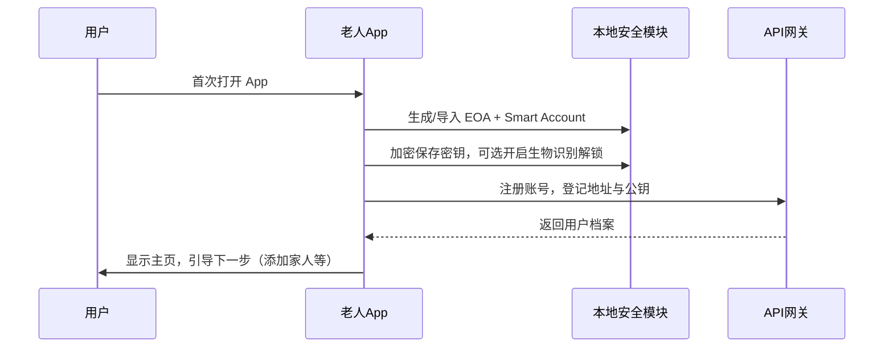

---

### 图 2：建立关系与访问组

**作用**：老人用二维码邀请家属加入访问组，双方完成关系确认后再互相发送必要资料，保证隐私和可控范围。

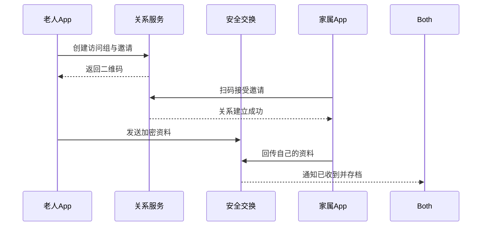

---

### 图 3：医生创建用药计划

**作用**：医生基于患者公钥编写密文计划，服务器只存加密内容，患者解密后即可按提醒执行。

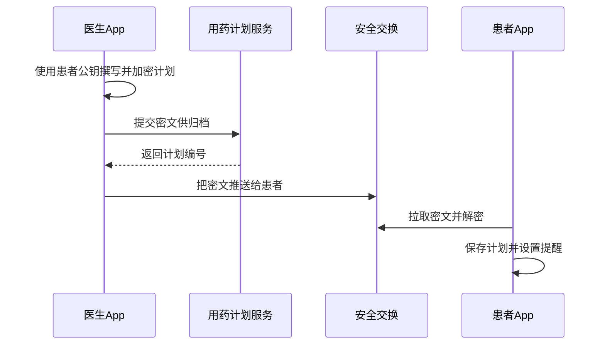

---

## 第二部分：日常使用流程

### 图 4：每日用药打卡

**作用**：患者在本地完成证明和记录，既能离线保存，也能在需要时分享给家属或提交上链。

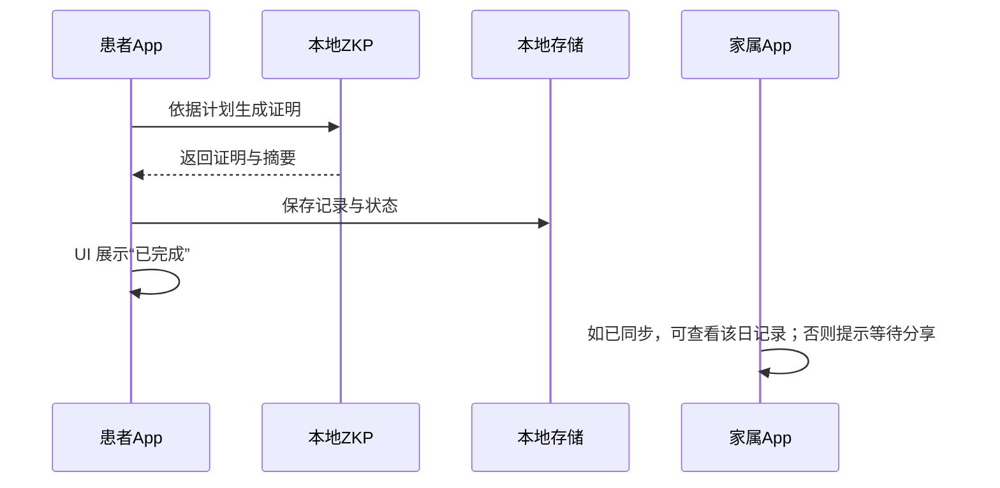

---

### 图 5：本地通知与用药提醒

**作用**：系统根据用药计划自动推送提醒，患者可在本地查看历史记录和提醒日历，确保按时服药。

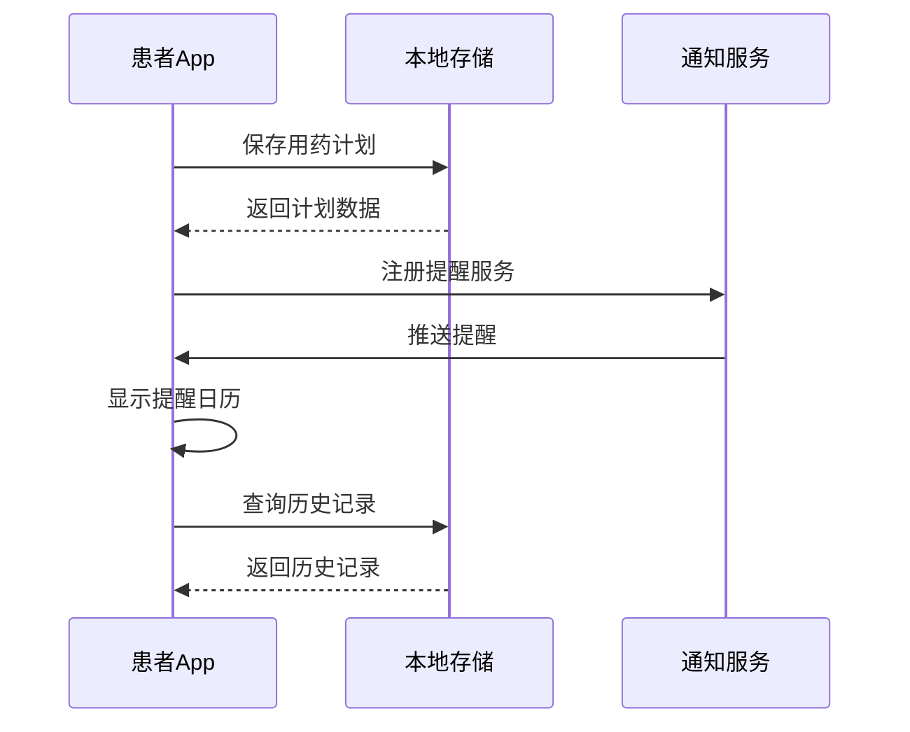

---

## 第三部分：周度汇总与上链

### 图 6：周度汇总 ZKP 生成（云端异步任务）

**作用**：前端提交周度 Merkle Root/leaves 后，云端异步生成周证明并返回 jobId，前端轮询状态获取 proof/publicSignals/calldata。

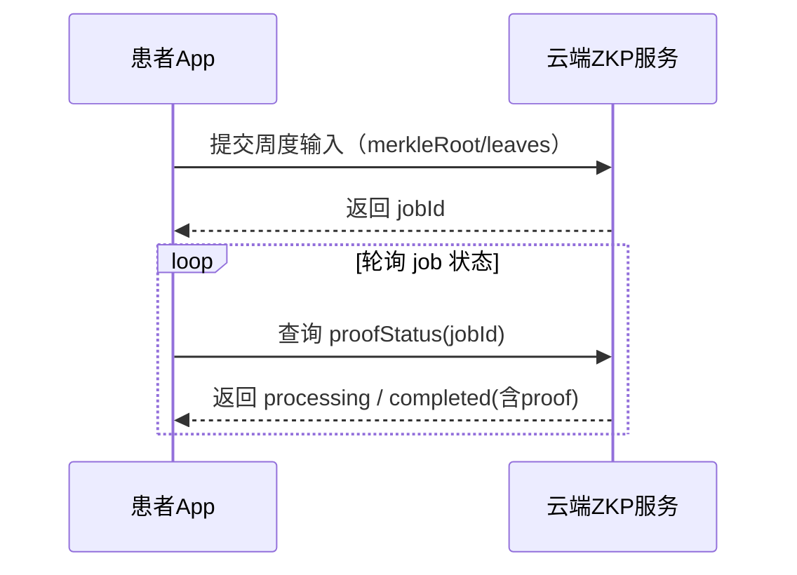

---

### 图 7：周度证明上链流程（IPFS + ERC-4337 UserOp）

**作用**：展示周度证明完成后如何上链：后端先把证明与记录打包上传 IPFS，再构建并提交 UserOp 调用智能账户合约记录 CID，最后通过通知回传交易结果。

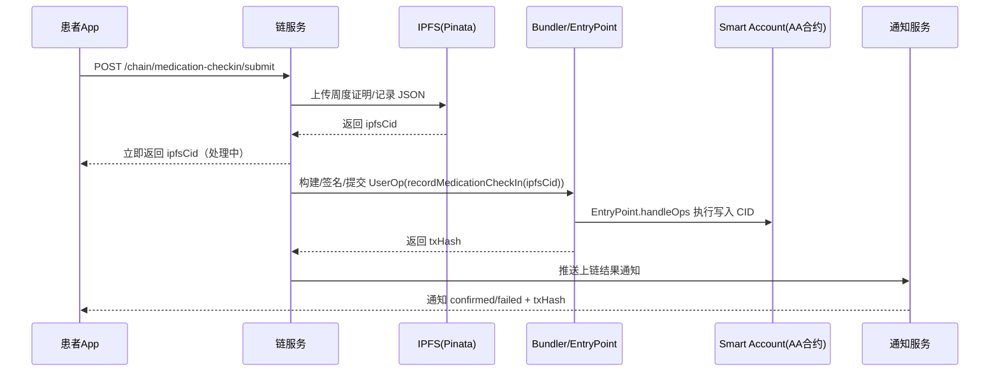

---

## 第四部分：账户管理与安全

### 图 8：账户迁移（设备更换）

**作用**：展示用户在更换手机时，如何通过一次安全的迁移流程，把原来设备上的密钥、打卡记录和用药计划完整搬到新设备上，全程由用户自己掌控密码。

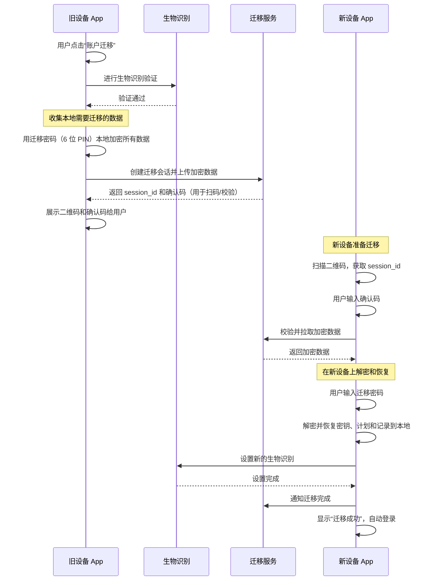

---

### 图 9：社交恢复（抽象账户 AA + Guardian）

**作用**：展示社交恢复的核心思路：由守护者协助发起/确认恢复操作，最终通过 ERC-4337 执行账户合约恢复逻辑，将 Owner 更新为新地址。

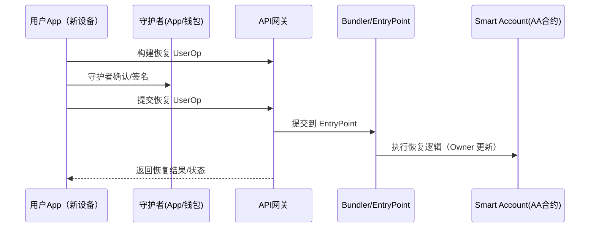

---

### 图 10：关系解绑与权限撤销

**作用**：当老人和家属不再需要互相关联时，通过一次解绑操作，双方本地权限和服务器上的访问都同步失效，后续任何访问尝试都会被拒绝。

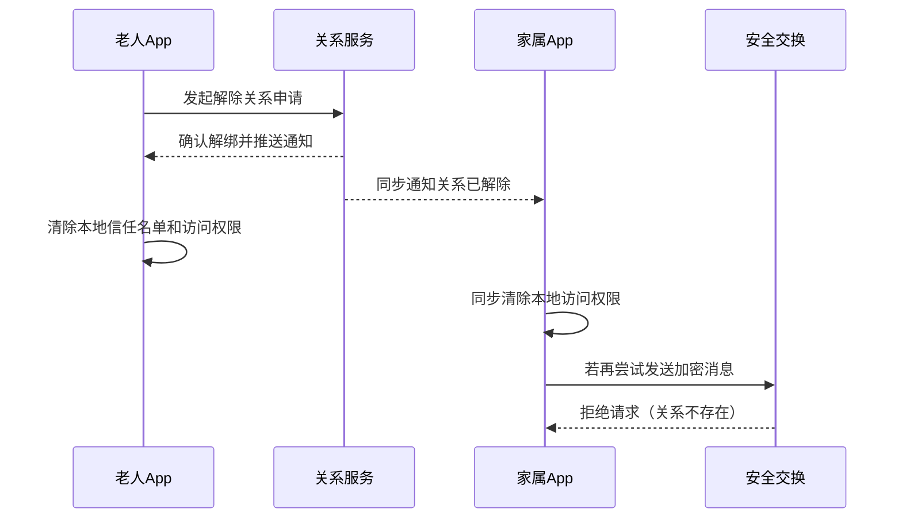

---

## 第五部分：隐私保护机制

---

### 图 11：端到端加密通信完整流程

**作用**：概括展示一次端到端加密通信的关键步骤：发送方用接收方公钥加密并签名，服务器只做密文中转，接收方拉取后验证签名并在本地解密，保证服务器全程看不到明文。

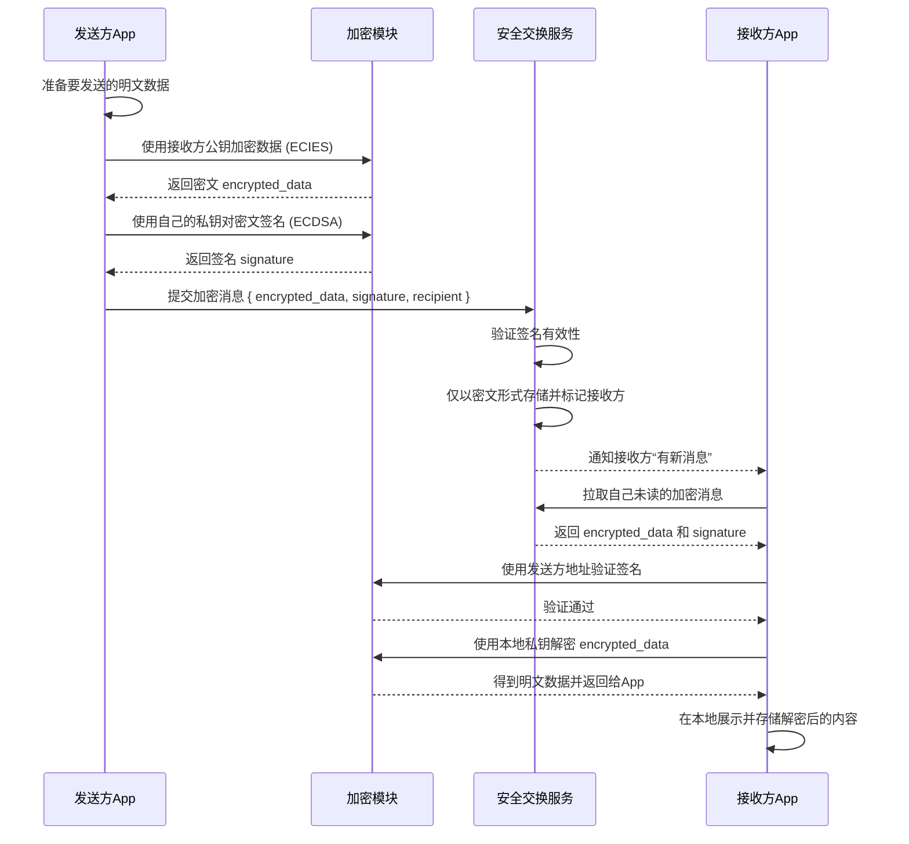

---

### 图 12：零知识证明（ZKP）本地生成详解

**作用**：概括展示客户端本地生成零知识证明的核心流程，从准备输入、调用电路到得到证明和公开信号并保存，为后续上链验证做好sequenceDiagram

```mermaid
    participant UI as 用户界面
    participant ZKP as 本地ZKP服务
    participant Circuit as 证明电路 (WASM)
    participant Store as 本地存储

    UI->>ZKP: 传入用药打卡相关输入 generateMedicalProof(input)
    ZKP->>ZKP: 在本地整理私有输入和时间等电路参数

    ZKP->>Circuit: 调用电路生成证明和 publicSignals
    Circuit-->>ZKP: 返回 { proof, publicSignals }

    ZKP->>ZKP: 生成适配智能合约的 calldata
    ZKP-->>UI: 返回 proof、publicSignals 和 calldata

    UI->>Store: 把证明结果和打卡记录一起存到本地
    Store-->>UI: 保存成功，用于后续查看或上链
```

---

## 系统特点总结

### 1. **完全本地化的隐私保护**

- 私钥存储在手机安全硬件，使用生物识别加密
- ZKP证明在本地生成，服务器无法获取原始数据
- 打卡记录保存在本地Capacitor存储

### 2. **端到端加密通信**

- 使用ECIES（secp256k1）加密，服务器只做盲目转发
- ECDSA签名确保消息真实性和完整性
- 用药计划、用户信息全程加密

### 3. **灵活的权限控制**

- 基于访问组的细粒度权限管理
- 通过本地白名单机制快速拒绝非法访问
- 支持动态解绑和权限撤销

### 4. **无密码体验**

- 基于生物识别的身份验证
- 社交恢复机制（Guardian多签）
- 无需记忆助记词或密码

### 5. **本地优先架构**

- 本地通知，无需后端定时任务
- 本地存储，支持离线查看
- 本地ZKP验证（view函数免费调用）

---

**文档版本**: v1.0
**最后更新**: 2025-11-05
**技术栈**: Vue 3 + TypeScript + Capacitor + ethers.js + snarkjs + Poseidon Hash
